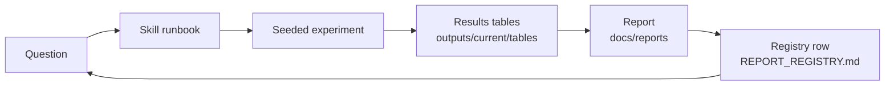
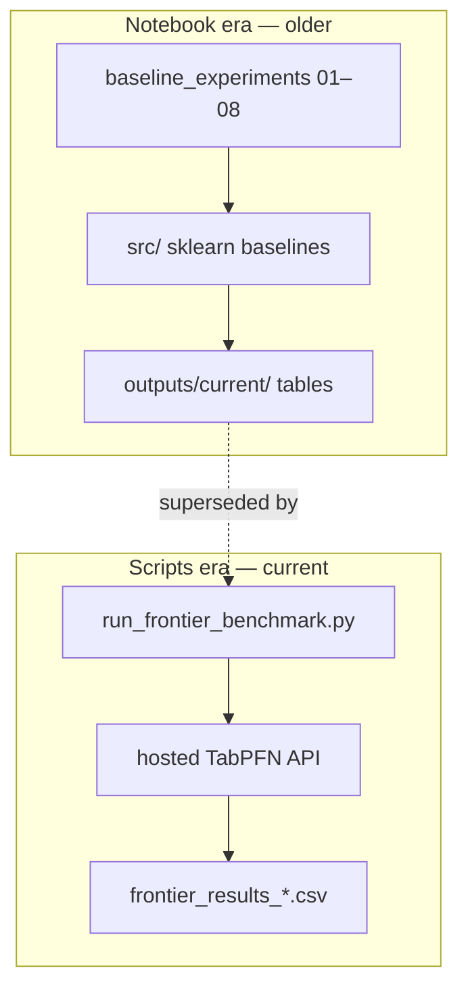
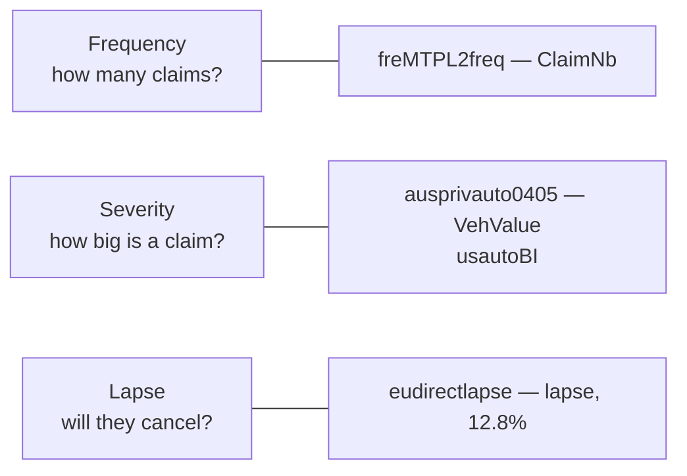
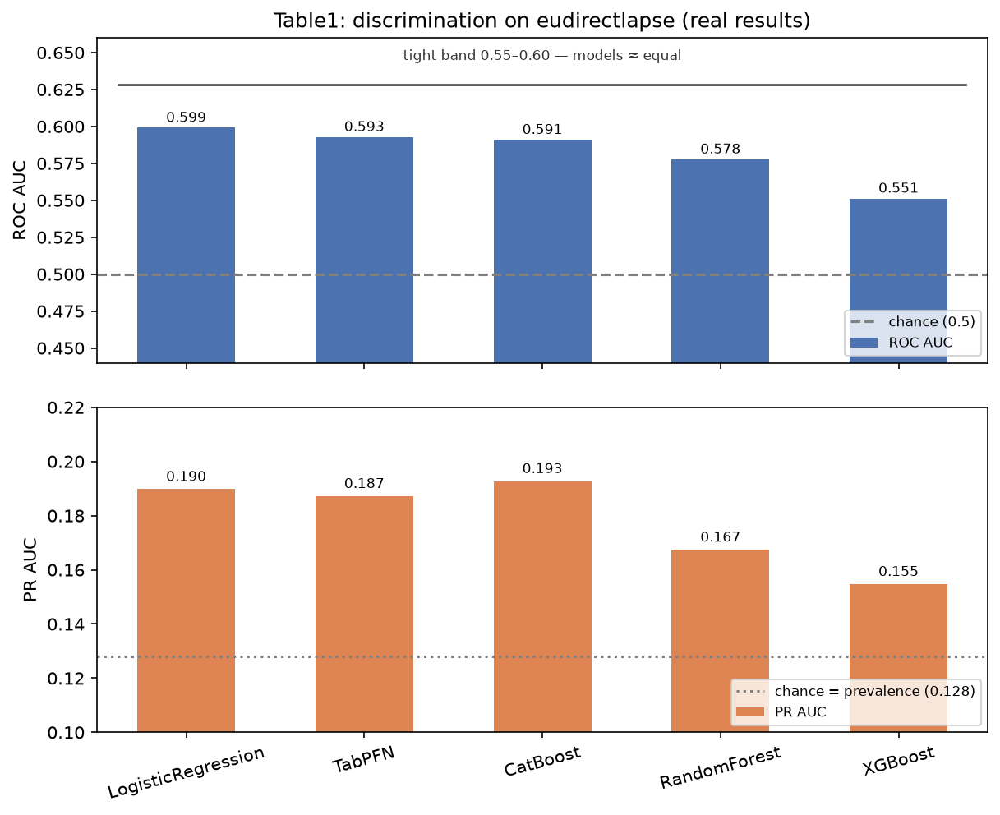
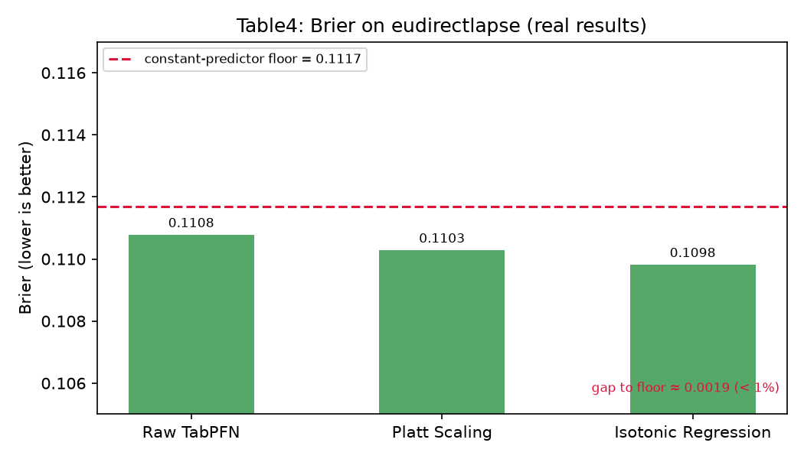
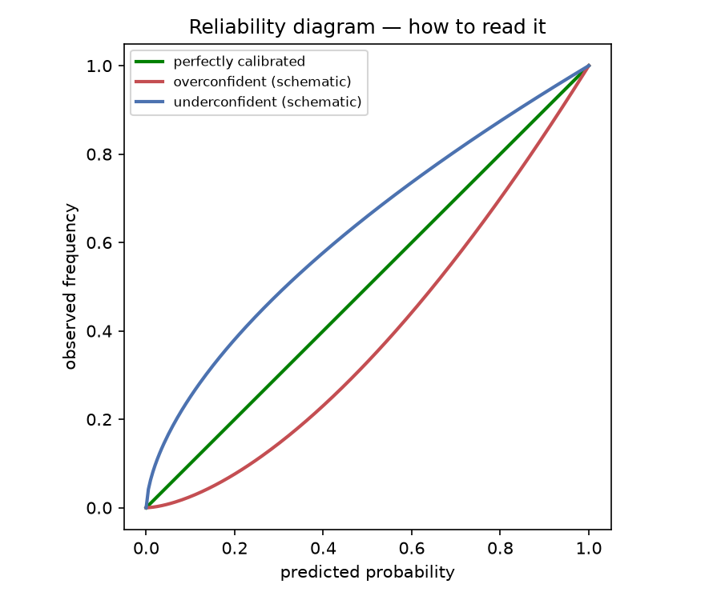
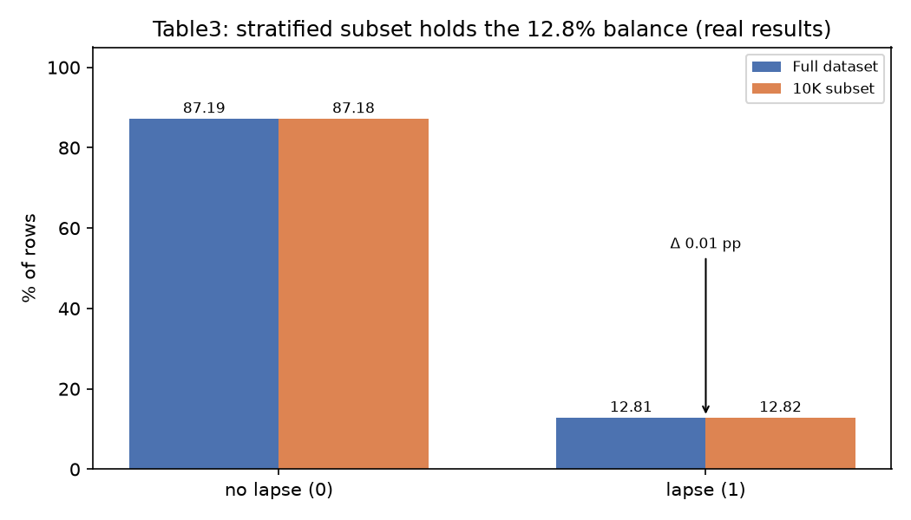
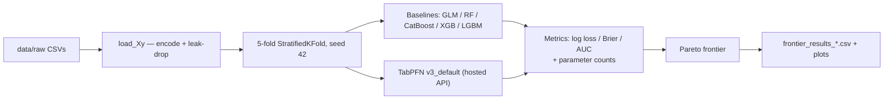

# Junior Knowledge Path — TabPFN Insurance Research Repo

Purpose: baseline understanding. This is the on-ramp for a junior data scientist. The goal is **not** to know every file — it's to run one experiment end-to-end and be able to explain every number in the results. Two weeks, ~2h/day.

Companion to `docs/KNOWLEDGE-PATH.md` (the full map + subject explanations). This doc is the junior route through it.

## The baseline understanding (what "done" means)

At the end you can:

1. Explain **discrimination vs calibration** and name which metric answers which question (ROC AUC, PR AUC, log loss, Brier, ECE)
2. Explain what TabPFN is — pretrained transformer, in-context learning, no training loop — in one minute
3. Name the three insurance tasks (frequency / severity / lapse) and which datasets map to them
4. Run one classification and one regression experiment via the repo's skills, seeded and reproducible
5. Read a results table and say whether a gap between models is real (same folds, paired) or noise
6. Trace one report from claim → evidence tables → registry row
7. Complete **the loop**: question → skill → seeded experiment → results → report → registry row

The loop is the team's entire operating model. The repo is practice material for it.

The other mental model you need: the repo has two eras that share almost no code — know which one you're in.

## How to use this path

- Four phases. Read them in order — each builds on the last.
- **Run first, read after.** Read code/specs with real outputs open, not before you have any.
- Use the skills (`.opencode/skills/`) as runbooks — they exist so you don't have to figure out how this repo runs experiments from scratch.

---

## Phase 0 — The Foundation Mini-Course (Days 1–2)

Goal: speak the language of the repo before you run anything. Six short lessons, using real numbers from `outputs/current/tables/`. Deeper background lives in main path Part 2 (**S1**, **S4**) and `docs/analyses/metrics_explained.md`.

### Lesson 0.1 — The insurance prediction problem

Three prediction tasks dominate insurance ML:

- **Frequency** — how many claims will this policyholder file? (a count). Repo dataset: `freMTPL2freq` (`ClaimNb`, 678k rows).
- **Severity** — when they claim, how big is the claim? (a positive amount). Repo datasets: `ausprivauto0405` (`VehValue`), `usautoBI`.
- **Lapse** — will the customer cancel? (binary). Repo dataset: `eudirectlapse` (23k rows, **12.81% lapse** — Table3).

Two domain terms that matter:
- **Pure premium = frequency × severity** — the quantity an insurer actually prices. Model it directly (Tweedie) or as two models.
- **Exposure** — policies cover different time periods; claim counts only compare after normalizing by exposure.

Note the task and target per dataset: `freMTPL2freq` → frequency/`ClaimNb`; `eudirectlapse` → lapse (and severity via `prem_pure`); `ausprivauto0405` → frequency/`ClaimOcc` and severity/`VehValue`.

Where it lives: `data/README.md`, `docs/analyses/regime_characterization.md`.

### Lesson 0.2 — Discrimination: can the model *rank* risk?

Discrimination = ordering. Given 1,000 policyholders, do the risky ones get the higher scores?

- **ROC AUC** — probability a random positive scores higher than a random negative. 0.5 = coin flip, 1.0 = perfect order. Ignores thresholds and probability magnitudes.
- **PR AUC** — area under the precision–recall curve; weights the positive class directly. **Use when positives are rare** (our case: 12.8%).
- **Top-decile lift** — of all real losses, what share sits in the top 10% of scores? The business translation of ranking.

**Worked example (real — Table1, eudirectlapse):**

| model | ROC AUC | PR AUC |
|---|---|---|
| LogisticRegression | 0.599 | 0.190 |
| TabPFN | 0.593 | 0.187 |
| CatBoost | 0.591 | 0.193 |
| RandomForest | 0.578 | 0.167 |
| XGBoost | 0.551 | 0.155 |

Read it like a scientist: (1) all five models sit in a tight band just above chance — lapse risk is genuinely hard to *rank*; (2) with prevalence 0.128, random guessing gives PR AUC ≈ 0.128, so ~0.19 is "clearly better than random but far from strong"; (3) the gaps between models (~0.01–0.03) are small — you cannot declare a winner from one table. That's what same-fold paired comparisons are for (Lesson 0.5, Phase 3).

PR AUC baselines move with class balance — a random predictor's PR AUC equals the prevalence — while AUC's baseline is fixed at 0.5.

### Lesson 0.3 — Calibration: are the probabilities *right*?

Ranking isn't pricing. A model can rank perfectly and still say "5% chance" when events happen 20% of the time. **Calibration** = predicted probability matches actual frequency.

The three numbers you'll see everywhere:
- **Brier score** — mean squared error of predictions vs outcomes (0 = perfect, 1 = always wrong, 0.25 = always predicting 0.5). Simple and proper.
- **Log loss** — penalizes confident wrong answers harder (a confident miss costs a lot). A *strict* proper scoring rule — you can't game it by hedging.
- **ECE** — bucket predictions, average |predicted − actual| per bucket. The number behind a reliability diagram.

**The constant-predictor baseline** (crucial intuition): predicting the base rate (12.81%) for everyone gives Brier = π(1−π) = 0.1281 × 0.8719 = **0.1117**. Any model must beat *that* to claim calibration value.

**Worked example (real — Table4):**

| method | Brier | vs raw |
|---|---|---|
| Raw TabPFN | 0.1108 | — |
| Platt scaling | 0.1103 | +0.45% |
| Isotonic regression | 0.1098 | +0.87% |

And the same idea in the picture form you'll see in the notebooks — a **reliability diagram** (schematic; the notebook-era figures are the real ones):

Two lessons in one table: (1) raw TabPFN starts *near the constant-predictor floor*, and post-hoc calibration barely moves it — the repo's finding is that TabPFN ships well-calibrated, which is exactly why we care about it; (2) even the best Brier here ≈ the floor — the same weak-signal story as Lesson 0.2. And Table2 shows *what* calibration did: raw TabPFN's mean predicted probability was 0.107 (slightly under-confident); after Platt/isotonic it's 0.128 — **exactly the base rate**. Calibrated means: on average, your predictions agree with reality.

Example: a model predicts 0.9 for 100 customers and 40 lapse → that bucket's ECE contribution is |0.9 − 0.4| = 0.5.

### Lesson 0.4 — The accuracy trap (imbalance)

**Worked example (real — Table1 + Table3):** eudirectlapse is 87.19% class 0. A model that predicts "no lapse" for everyone scores **87.19% accuracy** — the dumbest possible model. Table1's TabPFN/CatBoost/RF all show ~0.872 accuracy. Accuracy tells you nothing here; it's the "well, the sun came up again" metric. Discrimination (AUC) and calibration (Brier/log loss) are the real scores.

Rule of thumb: when the minority class is under ~20%, ignore accuracy.

XGBoost's accuracy is 0.857 — *worse* than predicting all-zeros — and yet it can still be the better risk model: accuracy depends on the decision threshold, and XGBoost trades accuracy for recall. A model that ranks and prices risk well is better even when its argmax accuracy is low — which is exactly why the repo scores discrimination + calibration, not accuracy.

### Lesson 0.5 — Experimental hygiene (the three rules)

- **Stratified split / CV** — keep the rare class proportional in every fold. Table3 shows it working: full set 12.81% lapse, the 10K pilot subset 12.82% (Δ 0.01pp). A non-stratified split would have drifted.
- **Fixed seed** — random splits are deterministic once seeded. This repo runs `seed=42` by default; other seeds write `_seed<N>` files so they never clobber canonical results.
- **Same folds** — every model scored on the *identical* train/test split. Only then are differences paired and statistically comparable (paired t-test), and only then are you comparing models instead of splits.

The "Subset (10K)" row exists because pilot subsets must preserve class balance so pilot conclusions transfer to full-data runs.

### Lesson 0.6 — Repo orientation (30 min, skimming)

Know these exist and what they're for:
- `README.md` — project purpose, environment, how to run things
- `data/README.md` — dataset provenance
- `docs/reports/REPORT_REGISTRY.md` — the index: every report, its evidence files, its dedup key
- `docs/analyses/` — specs and studies of the current (scripts) era
- `outputs/current/tables/` — **the source of truth** (you just read four files from it)

One-paragraph mental model (don't live here yet): the repo has two eras — the older notebook era (`notebooks/baseline_experiments/` + `src/`) produced the tables above, and the current scripts era (`scripts/eval/insurance_benchmark_v1/`) superseded it. Phase 3 covers the current era. For now: notebooks made the tables; scripts make the frontier.

### Phase 0 wrap-up

By now you should be able to:
- Say each of these in one sentence: *frequency, severity, lapse, pure premium, exposure, class imbalance, discrimination, calibration, ROC AUC, PR AUC, top-decile lift, Brier, log loss, ECE, isotonic regression, stratified CV, seed, same folds, standard error (SE), fold-noise tie.*
- Explain why PR AUC matters when positives are ~10% of the data
- Explain what ROC AUC does *not* tell you about a model that ranks well
- Explain what "same folds" means and why every comparison in this repo requires it
- Deeper reading when ready: `docs/analyses/metrics_explained.md` (v3, actuarial framing) and `docs/reports/TECHNICAL_COMPANION.md` §1 (legacy v2 numbers).
- Read Table1 like a scientist: the best ranking model is LogisticRegression at 0.599, but the band is ~0.55–0.60 — within noise of each other on one split — so no winner can be called from this table alone; single-table comparisons don't tell you about variance or paired significance.

## Phase 1 — First Runs Runbook (Days 3–5)

Goal: TabPFN works end-to-end on this machine, and you've seen real results. Three days, five lessons. Use the skills (`.opencode/skills/`) as your runbooks — they exist so you don't figure this out from scratch.

### Lesson 1.0 — Environment setup (30 min)

Do, in order:
1. Activate the notebook-era environment: `source .venv312/bin/activate` (Python 3.12.x, the preferred kernel per `docs/reports/MULTI_DATASET_GLM_VS_TABPFN_SUMMARY.md`). For a fresh checkout instead: `python -m venv .venv && pip install -r requirements.txt` (README).
2. Verify imports: `python -c "import tabpfn, tabpfn_client, sklearn; print('ok')"` — no import errors.
3. API key: the hosted client needs `TABPFN_API_KEY` — as an env var, or a `.env` file in the repo root, or `TABPFN_ENV_FILE` pointing elsewhere (README §setup; scripts fail with a clear error if missing). A cached token already exists in the repo's gitignored `.env`, so first runs may just work.
4. Note the **two ways to run TabPFN** in this repo: (a) the local package (notebook era, what you use this phase), and (b) the hosted API via `tabpfn_client` (`model_path="v3_default"`, what Phase 3's frontier scripts use). Same model, different plumbing.
5. Know the escape hatch: if a skill's API is missing from the installed package, the upstream source tree has it — `PYTHONPATH=/Users/Scott/Documents/Data Science/ADSWP/TabPFN-upstream/src` (tabpfn-explore skill).

**By now you should be able to:** confirm the import one-liner runs clean in your venv, and name which of the two TabPFN paths you just used.

### Lesson 1.1 — `tabpfn-explore`: pre-flight on eudirectlapse (morning, Day 3)

Goal: inspect before you train. Follow the skill's procedure:

1. Dataset + target: `data/raw/eudirectlapse.csv`, target `lapse` (binary — 23,060 rows × 18 features, 12.8% positive).
2. Inspect: row/column counts, dtypes, missingness, target distribution. You should *reproduce* the numbers in Table3: 87.19% / 12.81%.
3. Decide task: `lapse` is binary → classification.
4. **Leak check** (the explore step that saves you): scan features for anything that encodes the outcome itself. Real examples from `data/README.md`: spanish_motor's `N_claims_history`/`R_claims_history` (current-year leak, AUC 0.76/0.92 vs ~0.6 honest) and `Date_lapse` (presence AUC 0.85). The frontier script has a leak-drop list for exactly this.
5. Create a tiny **stratified** pilot subset (e.g. 10K rows, seed 42) — Table3's "Subset (10K)" row is the proof this works: 12.82% vs 12.81% (Δ 0.01pp).
6. Verify the import path (Lesson 1.0.5), then report: schema, balance, task, next skill.

**By now you should be able to:** say "classification, `lapse`, 12.8% balance, no leaks, pilot subset at data/…" without opening the file.

### Lesson 1.2 — `tabpfn-classify`: your first classifier run (afternoon, Day 3)

Follow the skill's procedure, in this order:

1. Confirm: dataset (pilot subset from 1.1), target `lapse`, metrics — **ROC AUC + PR AUC + log loss** (imbalance → PR AUC; calibration → log loss; skip accuracy — Lesson 0.4).
2. Validate target suitability (binary, balanced-enough pilot).
3. Run TabPFN with **explicit seed 42**, log the settings.
4. Capture time, memory, and the three metrics.
5. Sanity-check against the floors you learned in Phase 0:
   - ROC AUC should land in the Table1 band (~0.55–0.60 on this dataset) — if you see 0.7+, suspect a leak, not a miracle.
   - PR AUC should beat prevalence (0.128) but stay modest (~0.19±).
   - Accuracy ≈ 0.87 tells you *nothing* (Lesson 0.4).
6. Report per the skill: what was run, metric table, is it stable enough to scale, **one** concrete next step (more rows? different preprocessing?).

**By now you should be able to:** write your three metrics, with the floor comparison, in one table you could paste into a report.

### Lesson 1.3 — `tabpfn-regress`: first regression run (Day 4)

Now the harder task: `freMTPL2freq.csv`, target `ClaimNb` (claim count, **678,013 rows** — a pilot subset is mandatory, not optional, on a laptop).

1. **Target sanity first** (the skill's step 2, and the repo's hard-won lesson): continuous? Yes. Distribution? Counts, heavily right-skewed (most rows = 0 claims). Non-finite? **Check explicitly** — this dataset is where the repo found non-finite loss in TabPFN regressor fine-tuning (`outputs/current/logs/claimnb_finiteness_checkpoints.csv`); seeing the check catch things is the lesson.
2. Run a small seeded baseline: metrics RMSE/MAE (regression — no AUC/Brier here; that vocabulary returns in Phase 3 with Poisson deviance).
3. Note the natural "one next change" the skill asks for: a target transform (log1p) — flagged, not done, at this stage.

**By now you should be able to:** state ClaimNb's distribution shape, the result of the non-finite check, and one transform you'd try next.

### Lesson 1.4 — Read your own results (Day 5, morning)

1. Open `outputs/current/tables/` — this is the **ledger** (Phase 0, Lesson 0.6). Find the file your run wrote (classifier runs feed `tabpfn_finetune_trial_results.csv`-style ledgers; the notebook-era Table1–4 files show the format).
2. Read your row out loud, column by column, and classify each metric: *discrimination* (AUC) vs *calibration* (log loss, Brier) vs *cost* (fit/pred time).
3. Write down your exact command + seed + data path — "a colleague could reproduce this" is the bar the loop is built around.

**By now you should be able to:** read your table to someone and name which column answers which question.

### Lesson 1.5 — Read S2 and S3 with fresh eyes (Day 5, afternoon)

Now read main path Part 2, **S2** (GLM/GBDT baselines) and **S3** (TabPFN). After your own runs they'll land differently:
- "No training loop" should feel obvious — your fit was a single pass over labeled rows, then prediction.
- The GLM link-function list (logistic/Poisson/Tweedie) is exactly the `lapse` / `ClaimNb` / severity mapping from Lesson 0.1.
- The GBDT "tuning effort" claim is why the repo compares *zero-tune* TabPFN against *tuned* baselines (Phase 3).

### Phase 1 wrap-up

By now you should be able to:
- Explain why TabPFN needs no training, in one minute (prior fitting + in-context learning, not weights on your data)
- Reproduce both runs: command + seed + data path written down
- Read your classifier results table out loud — which columns are discrimination, which are calibration, and whether the numbers beat the Phase 0 floors

**Common failure modes (if something breaks):** missing API key → clear startup error (Lesson 1.0.3); import mismatch → installed package vs upstream `PYTHONPATH` (1.0.5); memory/runtime on Apple Silicon → shrink the pilot subset, keep first runs small (tabpfn-explore skill); `mps` slower than `cpu` on this hardware — prefer `cpu` for smoke runs.

## Phase 2 — Read the research arc (Days 6–8)

Goal: know what was tried and why the repo looks the way it does.

Do:
- Read these notebooks **in order, with `outputs/current/tables/` open next to them**: `baseline_experiments/02_tabpfn_vs_glm_lapse` → `04_probability_calibration` → `07_multi_dataset_benchmark` → `08_multi_dataset_regression_benchmark` → `06_synthetic_data_exploration`
- Notebook 06 is short and the finding is negative (augmentation hurts) — read it anyway; it saves you a month
- **Trace one report end-to-end:** pick any row in `REPORT_REGISTRY.md`, open the report, find its evidence files, and confirm the numbers in the report match the tables
- Read main path Part 2: **S6** (negative findings — learn these so you don't repeat them)

By now you should be able to:
- Summarize what each of those five notebooks concluded
- Trace a claim: report → table → experiment
- Name which notebook-era results are superseded (the 07/08 TabPFN arms were replaced by the frontier benchmark)

## Phase 3 — The live pipeline (Days 9–11)

Goal: the current system — the one that matters.

This is what a frontier benchmark run does, start to finish (you'll walk it line by line in this phase):

Do:
- Read the docstring of `scripts/eval/insurance_benchmark_v1/run_frontier_benchmark.py`, then run it on ONE small dataset (e.g. `bemtl97` or `coil2000`)
- Open `frontier_results_<dataset>.csv`: metric columns (`mean_auc`, `se_auc`, `mean_brier`, `se_brier`), parameter counts, Pareto status
- **Then** read `docs/analyses/insurance_frontier_benchmark_spec.md` and walk the script's flow (load → 5-fold CV → baselines + hosted TabPFN → metrics → Pareto frontier)
- Skim `run_tuned_baselines.py` (the "finality" comparison: tuned GLM/GBDT vs zero-tune TabPFN) and `run_reframe_frequency.py` (your current branch's topic)
- **Then the master report** (main path Stage 4.5): read `docs/analyses/tabpfn_vs_gbdt_baselines_finetuning.md` sections **§6** (the label leak), **§11** (imbalance + the 1−AUC blindness story), **§12** (why v1 looked lopsided), **§13** (size sweep), **§14.1–§14.4** (frontier + D3 rule), **§14.11** (AUC rescore), **§14.14** (the reframe you're working on). Skim the rest.
- Read main path Part 2: **S5** (methodology), **S9** (conclusions), **S10–S12** (metric eras, significance, self-correction case study)

By now you should be able to:
- Describe one frontier run end-to-end in five steps, no code
- Explain the Pareto frontier and why parameter counting matters (TabPFN's ~10M pretraining params vs GLM's `n_features + 1`)
- State what question the reframe-frequency experiment is asking
- State the current verdict: TabPFN **AUC #1 on all 6 classification datasets** (even against tuned baselines); regression/frequency stays GBDT territory; the GLM family is never dominated

## Phase 4 — Follow a completed loop end-to-end (Days 12–14)

Goal: the loop, complete — read it in finished form.

Read:
- Pick one report in `docs/reports/` (e.g. the reframe-frequency study) and read its objective, method, results, and limitation sections
- Open the evidence CSVs it points to (`outputs/current/tables/`, or wherever the report cites) and confirm the report's numbers come from them
- Open the matching reproducibility notebook in `notebooks/reproducibility/` and step through its cells — the evidence cells are pre-executed with committed outputs, so you can follow each step without running anything

By the end: you should be able to state the report's verdict, say whether its numbers support it, and name which evidence file backs each claim.

---

## What NOT to do yet (defer list)

- **TabArena harness** (`/tmp/tabarena`, `.venv-ta`) — tooling, not core; revisit only if asked
- **`legacy/` R scripts and `legacy_finetuning/`** — historical record; read-only archaeology, if ever
- **Embeddings** (`04_tabpfn_embedding_workflow.ipynb`) — side track, not in the current benchmark spine
- **Fine-tuning** — before running anything, read `docs/reports/TABPFN_FINE_TUNING_LIMIT_STUDY.md`. It's a bounded lever with real failure modes (save/load, regressor instability). Baseline first.
- **Paper replication** (`REPLICATION_There_Is_Life_in_the_Old_GLM_Yet.ipynb`) — until asked; it's the historical anchor, not the current work
- **Save/load and device debugging** — note the bug classes exist (issue #851); don't study them yet

## After the path

Return to the main knowledge path: finish Stages 4–5 (pipeline depth + reporting workflow), then pick extensions by interest. The loop is the job; everything else is depth.
