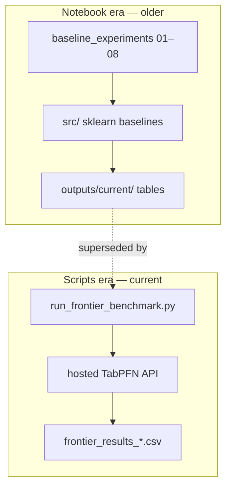
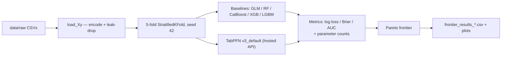
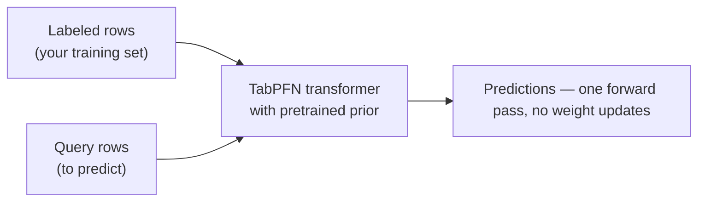

# Learning Path: TabPFN Insurance Research Repo

Purpose: a staged path from "new to the repo" to "understands the research, the code, and how to extend it". Each stage lists concrete artifacts to read/run. Topic explanations deliberately left thin — we refine content per stage later.

**Junior track:** if you're a junior data scientist, start with `docs/LEARNING-PATH-JUNIOR.md` (2-week baseline route: run-first, metrics-first, the loop as graduation test) and use this doc as reference.

## The one mental model you need first

The repo contains **two eras that share almost no code**:

1. **Notebook era (older)**: `notebooks/baseline_experiments/01–08` + `src/` (sklearn baselines, GLM-vs-TabPFN studies, calibration). Run on laptop, outputs in `outputs/current/`.
2. **Scripts era (current)**: `scripts/eval/insurance_benchmark_v1/` (frontier benchmark, tuned baselines, reframe-frequency) + `scripts/benchmarks/` (TabArena). Uses the **hosted TabPFN API** (`tabpfn-client`, needs `TABPFN_API_KEY`). Writeups in `docs/analyses/` + `docs/reports/`.

Treat them as two systems. **The scripts era is what's live now** — start its spine there, then read the notebook era for the historical arc.

Research question (as implied by the work): *does pretrained TabPFN beat tuned classical models (GLM/GBDT) on real insurance tasks — frequency, severity, lapse — in discrimination AND calibration, with realistic effort budgets?*

---

## Stage 0 — Orientation (30–45 min)

Goal: know what the repo holds and where things live.

Read:
- `README.md` (project purpose, structure, environment notes)
- `data/README.md` (dataset provenance — which insurance datasets exist and where they came from)
- `docs/` tree: `reports/REPORT_REGISTRY.md` (the index of every report + evidence), `analyses/` (specs/studies for current era)
- `outputs/current/` — skim `tables/` and `logs/domain_finetune_logbook.md` (this is the "source of truth" for results)
- `CHANGELOG.md` + `TASKS.md` (history + current state)
- `0_roadmap and project dashboard/` — the workstream roadmap (Excel dashboard: current state, milestones)

By the end of this stage: you can name 5 datasets, the two eras, and where results accumulate.

## Stage 1 — Domain & metrics foundation (2–4 h)

Goal: understand what insurance tasks look like and how we score models. This is the vocabulary used everywhere else.

Read:
- `docs/analyses/metrics_explained.md` (ROC AUC, log loss, Brier, PR AUC, ECE — the metric set used across the repo)
- `docs/analyses/class_imbalance_analysis_summary.md` (the core problem: ~10% positive classes in lapse/claims)
- `docs/analyses/regime_characterization.md` and `docs/analyses/benchmark_portfolio.md` (which datasets are which regime: frequency vs severity vs lapse)
- Gloss (outside repo if needed): frequency/severity modeling, GLM + Poisson/Tweedie/Logistic, calibration (reliability, isotonic regression)

By the end of this stage: given a result table with AUC/log_loss/Brier, you can say which columns tell you discrimination vs calibration vs business value.

## Stage 2 — TabPFN core concepts (3–5 h)

Goal: understand the model itself — what "pretrained" means here, why there's no training loop.

Read:
- `docs/reports/TABPFN_BENCHMARK_SUMMARY.md` + `docs/reports/TECHNICAL_COMPANION.md` (repo's own intro to TabPFN)
- `docs/reports/COMBINED_TABPFN_CLASSIFIER_REGRESSOR_ANALYSIS.md` (classifier + regressor behavior on our data)
- Run one pilot yourself following `.opencode/skills/tabpfn-classify/SKILL.md` (or `tabpfn-regress` / `tabpfn-explore` for pre-flight) — the skills are the repo's own runbooks
- `notebooks/adswp_project/REPLICATION_There_Is_Life_in_the_Old_GLM_Yet.ipynb` — first real study: pretrained TabPFN vs GLM, post-hoc isotonic calibration; artifacts in `outputs/replication/`

By the end of this stage: you can explain why TabPFN predictions need no fitting, and what post-hoc calibration is for.

## Stage 3 — The research arc (4–6 h)

Goal: read the experiment lineage in order; this is the story of how conclusions evolved.

Read in order (notebook era):
1. `notebooks/baseline_experiments/01_claims_classification_baseline.ipynb` — first binary claim-frequency framing
2. `02_tabpfn_vs_glm_lapse.ipynb` — the main calibration study (Tables 1–4, Figures 1–6 in `outputs/current/`)
3. `03_tabpfn_vs_glm_summary.ipynb` — synthesis + fairness/diagnostics
4. `04_probability_calibration.ipynb` — post-hoc optimization, production readiness
5. `07_multi_dataset_benchmark.ipynb` + `08_multi_dataset_regression_benchmark.ipynb` — widening to 4-classify/3-regress suites (results in `data/processed/`)
6. `06_synthetic_data_exploration.ipynb` — augmentation study (finding: augmentation degraded performance — read before you ever propose it)

Then the era switch: `docs/analyses/tabarena_insurance_benchmark_direction.md` + `merge_plan_tabarena.md` (why the work moved to scripts + hosted API).

By the end of this stage: you can summarize what each notebook concluded and why the pipeline changed shape.

## Stage 4 — Current pipeline in depth (4–6 h)

Goal: the live system. This is the branch you're working on (feat/reframe-frequency-classification).

Read (scripts era):

- `scripts/eval/insurance_benchmark_v1/run_frontier_benchmark.py` — the canonical harness: load → 5-fold CV → sklearn baselines + hosted TabPFN → metrics → Pareto frontier. Trace the flow function by function (entry: `--regression`, `--pr-auc`, `--seed`; outputs: `frontier_results_*.csv`).
- `scripts/eval/insurance_benchmark_v1/run_tuned_baselines.py` + `analyze_tuned_baselines.py` — the "finality" test: tuned GLM/GBDT vs zero-tune TabPFN (see `docs/analyses/tabpfn_vs_gbdt_baselines_finetuning.md`, `docs/analyses/insurance_frontier_benchmark_spec.md`)
- `scripts/eval/insurance_benchmark_v1/run_reframe_frequency.py` + `analyze_reframe_frequency.py` — frequency → binary/ordinal reframe (the current branch's topic; see `docs/analyses/frontier_auc_brier_rescore_spec.md`)
- `scripts/eval/insurance_benchmark_v1/analyze_pr_auc.py` (paired stats), `plot_money_chart.py` (size-vs-ratio economics)
- `docs/analyses/cpu_model_feasibility.md` + `docs/analyses/levers_assessment.md` (effort/cost framing)

By the end of this stage: you can describe what one frontier benchmark run does end-to-end, and what the current reframe-frequency experiment is testing.

## Stage 4.5 — Master report walkthrough (2–3 h)

The evidence spine of everything above: `docs/analyses/tabpfn_vs_gbdt_baselines_finetuning.md` (§1–§15, ~1600 lines). Read in this order:

1. **§1–§4 + §6** — objective, setup, v1 results, the bemtl97 label leak
2. **§11–§12** — the imbalance pilot and "why v1 looked lopsided" (the blindness lesson)
3. **§13 + §14.1–§14.4** — size sweep + the frontier, the D3 rule, what an actuary should take away
4. **§14.6–§14.10** — extensions: at-scale (norauto), regression phase 2, Spanish motor
5. **§14.11–§14.14** — the 2026-08 verdict arc: rescore, ranking robustness, finality test, reframe
6. **§15** — version-drift policy (skim)

Pair each with its evidence CSVs (`scripts/eval/insurance_benchmark_v1/frontier_results_*.csv`, `reframe_frequency_results.csv`). The wiki (`TabPFN-work-scott/.wiki-content/` or live GitHub wiki) is the summary layer: `Findings-Overview.md` (the "so what" page), `Adoption-Guidance.md` (the decision rule — read this before quoting verdicts), `Findings-Report-Index.md`, `Metrics-Explained.md`, `Reproduction-Guide.md`, `Codebase-Overview.md`. When you need the arc without the detail: `docs/MASTER-REPORT-DIGEST.md` (one paragraph per addendum). To run the experiments yourself and see the exact code behind them: `notebooks/reproducibility/` (README first — three notebooks reproducing §14.11, §14.13, §14.14 by calling the canonical scripts).

By the end of this stage: you can explain what changed between §4 and §14.14 and *why*, and name the three most robust results (GLM never dominated; AUC #1 on 6/6 classification; regression stays GBDT).

## Stage 5 — Skills & reporting workflow (2–3 h)

Goal: how work actually gets done here — runbooks + the evidence chain.

- Read the 8 skills in `.opencode/skills/`: `tabpfn-explore`, `tabpfn-classify`, `tabpfn-regress`, `tabpfn-finetune`, `tabpfn-benchmark`, `tabpfn-technical-report`, `tabpfn-nontechnical-report`, `insurance-objective`. Note each one's entry criteria and outputs.
- Learn the evidence flow: experiment → `outputs/current/{tables,logs}` → report in `docs/reports/` → row in `REPORT_REGISTRY.md` (dedup before drafting — the registry is the anti-duplication lock).
- `scripts/` housekeeping: `cleanup_outputs.py`, `scripts/infra/make_notebook.py` (scaffold new experiment notebooks)

By the end of this stage: given a new research question, you can name which skill(s) you'd invoke and where the evidence would land.

## Stage 6 — Extensions (optional, pick what's relevant)

- Fine-tuning: `docs/reports/INSURANCE_DOMAIN_FINETUNING_METHOD_PROTOCOL.md`, `TABPFN_FINE_TUNING_LIMIT_STUDY.md`, `docs/analyses/tabpfn_small_finetune_methodology.md`, plus `scripts/legacy_finetuning/` (historical local runs)
- TabArena harness: `scripts/benchmarks/run_tabarena_insurance_benchmark.py` (needs external `/tmp/tabarena` env), `docs/analyses/tabarena_reference.md`
- Embeddings: `notebooks/adswp_project/04_tabpfn_embedding_workflow.ipynb`
- Model catalog context: `docs/analyses/tabular_foundation_models_catalog.md`
- Side studies: `docs/reports/CLASSIFIER_HOMOGENEITY_HYPOTHESIS_METHOD.md` (round 2/3 — does a homogeneous fine-tuning pool beat a heterogeneous one? inconclusive; read for the method, not the verdict)
- The paper layer: `docs/papers/` — the GLM paper, the round-2 journal follow-ups (`FOLLOW_UP_ROUND2_JOURNAL_SHORT.md` / `FOLLOW_UP_ROUND2_JOURNAL_PLAIN.md`; *historical record — the "no universal winner" conclusion is superseded on AUC by §14.11*, the docs themselves carry this banner), `APPENDIX_REPRODUCIBILITY.md`, and `docs/REPLICATION_SETUP_GUIDE.md` (step-by-step paper replication)
- Repo hygiene history: `docs/audit/CODEBASE-GAP-2026-08-07.md`, `docs/status/STATUS_REPORT_FINAL.md`

**Deliberately not in this path** (look here only if you must): `docs/analyses/tabpfn_finetune_limit_test_plan.md` (superseded by the executed limit study), `docs/sessions/2026-07-28-tabarena-benchmark-setup.md` (session log), `docs/status/SECURITY_INCIDENT_RESOLVED.md` (ops record), `tests/` (smoke-only coverage), `legacy/` (deprecated R scripts).

---

## Suggested order & effort

| Stage | Effort | Do it when |
|---|---|---|
| 0 Orientation | 30–45 min | now |
| 1 Domain & metrics | 2–4 h | before touching results |
| 2 TabPFN concepts | 3–5 h | before running anything |
| 3 Research arc | 4–6 h | before reading specs |
| 4 Current pipeline | 4–6 h | before changing code |
| 5 Skills & reporting | 2–3 h | before contributing results |
| 6 Extensions | optional | as needed |

Total core: ~2–3 days of focused reading, spread how you like. Stages are sequential but 0–2 can be interleaved with browsing the repo casually.

---

# Part 2 — The subjects themselves

Plain-language explanations of the ideas this repo is about, in dependency order. Each section ends with where the subject lives in the repo. Deliberately not exhaustive — refine per topic later.

## S1. The problem: insurance risk modeling

Insurance pricing and risk management are prediction problems over policyholders. Three classic prediction targets appear in this repo:

- **Frequency** — how often will a policyholder claim? A count (0, 1, 2… claims per exposure period). Dataset: `freMTPL2freq` (French motor, `ClaimNb`).
- **Severity** — when they do claim, how big is the claim? A positive amount. Dataset: `ausprivauto0405` (`VehValue` proxy), `usautoBI` (bodily injury).
- **Lapse** — will the customer cancel (churn)? A binary yes/no. Dataset: `eudirectlapse` (EU life insurance, ~12.8% lapse rate).

Key domain concepts:
- **Pure premium** = frequency × severity. This is the quantity an insurer actually prices. You can model it directly (Tweedie GLM) or as two separate models.
- **Exposure** — policies cover different lengths of time; counts must be normalized by exposure before comparing frequencies.
- **Imbalance** — claim/lapse events are rare (single-digit to ~13% positives). This drives metric choice (PR AUC over AUC) everywhere in the repo.

Where it lives: `data/README.md` (provenance), `docs/analyses/regime_characterization.md` (which dataset is which regime), `docs/analyses/class_imbalance_analysis_summary.md`.

## S2. The classical baselines (the "old" way)

**GLM (Generalized Linear Model)** — the insurance industry standard since the 1990s, and the subject of the paper this repo replicates (*There's Life in the Old GLM Yet*). A GLM is a linear model with a *link function* so it can model non-normal targets:
- Logistic link → binary (lapse, has-claim)
- Poisson link → counts (frequency)
- Gamma/Tweedie → positive amounts (severity, pure premium)

GLMs are interpretable (you can read off the coefficient of every feature), regulated/auditable, and cheap. Their weaknesses: you must encode categorical features and design interactions by hand, and they can't find nonlinear patterns the engineer didn't build in.

**GBDT (Gradient Boosted Decision Trees — XGBoost/LightGBM/CatBoost)** — the modern tabular workhorse. Hundreds of shallow trees, each correcting the errors of the previous ones. Great at finding nonlinearity and interactions automatically; the catch is **hyperparameter tuning** — a good GBDT result usually requires a tuning budget (learning rate, depth, regularization, early stopping).

**The central framing of this repo:** model quality must be judged *against effort*. A zero-tune TabPFN vs a tuned GBDT is the comparison that matters for a real actuary team. See `docs/analyses/levers_assessment.md` and the "finality test" in `run_tuned_baselines.py`.

Where it lives: `src/model_training.py` (baseline zoo), `src/baseline_utils.py` (preprocessing + eval), `docs/papers/Theres-Life-in-the-Old-GLM-Yet.md`.

## S3. TabPFN — the transformer for tabular data

**What it is:** a transformer neural network (like GPT, but for tables, not text) **pretrained on millions of synthetic tabular datasets**. The key idea is **prior fitting**: during pretraining the model learns a general prior over "what tabular data looks like" — feature relationships, noise levels, distributions — instead of learning any one task.

**How it's used (the part that surprises everyone):** there is **no training loop on your data**. You hand it your labeled rows plus the rows you want to predict, in one forward pass:
- The labeled rows act as the **context** (like few-shot examples for an LLM)
- The model conditions its prediction for each new row on that context
- This is **in-context learning**: the model doesn't update weights, it *reasons* using your examples as context

Practically: `TabPFNClassifier("v3_default")` / `TabPFNRegressor`, fit on your training set, predict probabilities directly. It handles mixed categorical/numeric features natively (no one-hot encoding of hundreds of levels).

**Why it matters here:**
- **Zero tuning** — no hyperparameter search, no feature engineering; the pretrained prior does the work
- **Calibration** — its probability outputs tend to be well-calibrated out of the box (see S4), which is exactly what pricing needs
- **Small-data strength** — transformers pretrained on priors beat data-hungry methods when you have a few thousand rows (TabPFN's natural regime)

**Hosted vs local:** this repo evolved from a local `torch` install (notebook era) to the **hosted API** (`tabpfn-client`, `TABPFN_API_KEY`) in the scripts era — the frontier benchmark calls the API with retry/backoff.

**Fine-tuning (optional):** TabPFN can be trained *further* on your own data (a few epochs, small learning rate, limited context) — this is the "fine-tune" track of the research. Repo findings to date: works on tiny data (128–500 rows), context sizes 64–128, 1 epoch smoke tests; on Apple Silicon `cpu` beat `mps`; **save/load reliability was a real bug class** (issue #851); and **regressor fine-tuning on claim counts was numerically unstable** (non-finite loss — the `claimnb_finiteness_checkpoints` ledger). Conclusions live in `docs/reports/TABPFN_FINE_TUNING_LIMIT_STUDY.md`, `INSURANCE_DOMAIN_FINETUNING_METHOD_PROTOCOL.md` (protocol) and `STAGE_A_B_FINDINGS_AND_RECOMMENDATIONS.md` (non-technical summary).

Where it lives: `docs/reports/TABPFN_BENCHMARK_SUMMARY.md` + `TECHNICAL_COMPANION.md` (repo's own intro), skills `tabpfn-classify` / `tabpfn-regress` / `tabpfn-finetune` (runbooks), `docs/analyses/tabular_foundation_models_catalog.md` (context: other tabular FMs).

## S4. Scoring models: discrimination vs calibration

Two distinct things "a good model" can mean, and the repo carefully separates them:

**Discrimination — can the model *rank* risk?** Given two policyholders, does the higher-scored one have the higher risk?
- **ROC AUC** — ranking quality over all thresholds; insensitive to class balance.
- **PR AUC** — precision/recall tradeoff; the honest metric for rare positives (~10% classes), because it weights the positive class directly.
- **Top-decile lift** — business framing: how much of all risk is concentrated in the top 10% of scores (directly useful for pricing/underwriting).

**Calibration — are the probabilities *right*?** Does a 30% predicted probability mean events actually happen 30% of the time?
- **Log loss** (cross-entropy) — penalizes confident wrong answers; a strict proper scoring rule.
- **Brier score** — mean squared error of probabilities vs outcomes (0=perfect, 1=always wrong); proper and simple.
- **ECE (expected calibration error)** — buckets predictions and measures average |predicted − actual| per bucket; the number behind reliability diagrams.
- **Isotonic regression** — the post-hoc fix: fit a monotone map from raw predictions to empirical frequencies on a holdout set, restoring calibration after the fact.

**Why the distinction is the research:** a model can rank perfectly (high AUC) while being useless for pricing (probabilities off by 2×), or be perfectly calibrated but not rank well. GLMs are calibration-native; GBDTs need probability calibration (e.g. Platt/isotonic); TabPFN's claim is good calibration *without* post-hoc. The repo's arc: `02_tabpfn_vs_glm_lapse.ipynb` (calibration-first study, Tables 2/4, Figures 1–6) → `04_probability_calibration.ipynb` (isotonic post-hoc, production assessment) → frontier benchmark now records AUC **and** Brier (`docs/analyses/frontier_auc_brier_rescore_spec.md`).

Where it lives: `docs/analyses/metrics_explained.md` (the repo's own metric explainer), `docs/reports/POST_HOC_OPTIMISATION.md` (the 04-notebook calibration study), `src/evaluation_metrics.py`, `src/baseline_utils.py::calibration_error`.

## S5. The experimental methodology (how claims get tested)

- **5-fold stratified cross-validation, seed 42** — every model sees the same folds; stratified keeps the rare class proportional per fold; `--seed` flags let runs reproduce (non-42 seeds write `_seed<N>` outputs without clobbering canonical ones).
- **Paired significance** — models are compared on the *same folds*, so paired t-tests (`analyze_pr_auc.py`) are the honest significance test, not comparing means.
- **Pareto frontier + parameter counting** — the frontier benchmark measures quality (log loss/Brier/AUC) against *model size*: GLM = `n_features + 1` params, tree models = leaves counted from fitted fold-0 trees, TabPFN = fixed ~10M (constant, from pretraining — you don't pay that cost yourself). The **money chart** (`plot_money_chart.py`) plots quality-per-size so you can see which models are on the efficient frontier — the models you'd actually deploy.
- **The "finality" test** (`run_tuned_baselines.py`) — the fairness question: tuned GLM/GBDT (realistic tuning budget) vs zero-tune TabPFN on identical folds. Verdicts feed the adoption recommendation (§14.13).
- **Home-turf size sweep** (`run_home_turf_size_sweep.py`) — TabPFN vs GBDT across dataset sizes, testing the hypothesis that TabPFN wins where data is scarce and loses where data is plentiful.
- **Reframing** (`run_reframe_frequency.py`, the current branch) — claim *counts* are awkward for a classifier-first model, so frequency is reframed as **binary** (has-claim?) or **ordinal** (0/1/2+ claims) targets and rescored (§14.14). This is an open research question, not a settled choice.

Where it lives: `docs/analyses/insurance_frontier_benchmark_spec.md` (the spec), `scripts/eval/insurance_benchmark_v1/run_frontier_benchmark.py` (the harness), `docs/analyses/tabpfn_vs_gbdt_baselines_finetuning.md` (the synthesis).

## S6. Side experiments with negative findings (learn these so you don't repeat them)

- **Data augmentation hurt.** Synthetic data (tabpfn-extensions), SMOTE, and noise-based augmentation of the lapse dataset all *degraded* performance — noise augmentation pushed Brier up ~13.8% and ROC AUC from 0.83 → 0.59. The prior is already rich; injecting synthetic rows pollutes it. See `notebooks/baseline_experiments/06_synthetic_data_exploration.ipynb`.
- **TabFM was scoped and not run** — evaluated as a baseline candidate, closed out as not worth pursuing (bus log §14.13).
- **Regression fine-tuning instability** — non-finite loss on claim-count targets (S3); the classifier track is the stable one.

Where it lives: notebook `06`, `scripts/legacy_finetuning/` (historical record), `docs/reports/INSURANCE_SPECIFIC_FINETUNING_EVIDENCE.md`.

## S7. Embeddings (a different way to use TabPFN)

Instead of taking TabPFN's *predictions*, take its **embeddings** — the internal representation of each row — and feed them to a downstream model (LR/RF). The idea: TabPFN's prior gives you features that already encode structure, so a cheap downstream model can win with far less data. Explored early (`04_tabpfn_embedding_workflow.ipynb`) on sklearn toy datasets; not part of the current benchmark spine.

## S8. TabArena (the benchmark ecosystem)

A community harness for tabular foundation models (leaderboards, standardized configs). The repo used it for the first multi-dataset insurance benchmarks before building its own `run_frontier_benchmark.py`. Requires an external checkout (`/tmp/tabarena`) and its own venv — treat as tooling, not core reading. See `docs/analyses/tabarena_reference.md`.

## S9. What the repo has concluded so far (the qualitative scoreboard)

Exact numbers live in the evidence files listed; these are the conclusions the evidence supports:

1. **TabPFN is competitive with the classics on insurance tasks without tuning** — the frontier benchmark and head-to-head tables (`data/processed/glm_vs_tabpfn_head_to_head.csv`) place zero-tune TabPFN at or near the efficient frontier on discrimination, and strong on calibration (Brier/log loss). [evidence: `frontier_results_*.csv`, `docs/reports/TABPFN_BENCHMARK_SUMMARY.md`]
2. **The tuned-baseline challenge is the fair test, and it narrows the gap** — tuned GLM/GBDT on the same folds is the honest comparison; the §14.13 "finality verdict" documents where TabPFN still wins and where it doesn't. [evidence: `analyze_tuned_baselines.py` outputs, `docs/analyses/tabpfn_vs_gbdt_baselines_finetuning.md`]
3. **Data augmentation and synthetic data don't help — they hurt.** (S6)
4. **Fine-tuning is a bounded lever** — works on small data with the right settings, but save/load and regressor stability are real failure modes; the limit study maps the envelope. [evidence: `outputs/current/tables/tabpfn_finetune_trial_results.csv`, `TABPFN_FINE_TUNING_LIMIT_STUDY.md`]
5. **Imbalance is the dominant regime problem** — PR AUC and focused imbalance pilots exist because rare positives are the norm; log-loss rescoring (`rescore_focused_imbalance_logloss.py`) shows calibration degrades under imbalance and needs watching. [evidence: `focused_imbalance_*.csv`, `docs/analyses/class_imbalance_analysis_summary.md`]
6. **Frequency reframing (binary/ordinal) is the open question** — the current branch's experiment (§14.14). [evidence: `reframe_frequency_results.csv`, `run_reframe_frequency.py`]
7. **2026-08 master verdict (the one to know now):** TabPFN is **AUC #1 of 9 methods — and of 14 once tuned baselines are added (§14.13) — on all six classification datasets** (deltas +0.006 to +0.033 over the best GLM; paired-significant 5/6); regression/frequency stays GBDT territory (Poisson deviance at scale: TabPFN ~+33% behind on freMTPL2freq); the **GLM family is never dominated on any frontier**; fine-tuning does not consistently help; reframing counts as classification inverts the frequency verdict. [evidence: master report §14.11–§14.14]
8. **The imbalance lever harms calibration** — `balance_probabilities=True` inflates mean predicted probability ~5× on a 6% base rate (coil2000 log loss 0.4716 vs 0.2008 default). [master report §11]

---

### S10. Metric eras and the 1−AUC blindness lesson

The master report's history is a lesson in how **the metric defines what you can see**:

- v1 scored `1 − ROC AUC` (AUC in error form). ROC AUC is **rank-invariant to monotone transforms** — so `balance_probabilities`, a monotone calibration rescale, was *provably invisible* to the v1 metric (identical to ≤1e-16 on every fold). Testing the imbalance hypothesis on 1−AUC was a measurement dead end.
- §11.3 introduced the **insurance-native metrics** — log loss + Brier ("what an insurer actually pays on") — and the v1 headline "TabPFN loses" became "loses *partly because of the metric*".
- Metric eras: 1−AUC (v1) → log loss/Brier (§11.3) → per-fold AUC+Brier (§14.11) → PR AUC + top-decile lift (§14.12) → multiclass set for ordinal reframes (§14.14).
- Lesson: before trusting a headline, ask what metric produced it and what that metric is blind to.

### S11. Noise, significance, and the beyond-SE frontier rule

- **SE** = std(ddof=1)/√5 across folds. Two models whose means differ by less than their SEs are **fold-noise ties** (bemtl97: LGBM 0.3418 vs TabPFN 0.3428).
- **D3 rule (how "on the Pareto frontier" is decided):** A is dominated iff some B with strictly fewer parameters has `mean_B + SE_B < mean_A − SE_A`. Within-SE models both stay on the frontier. A point-estimate rule would let fold noise decide membership.
- **Paired per-fold t-test (df=4) ≫ unpaired z** — norauto PR-AUC: z=1.26 (not significant) vs t=9.02 (p=0.0008). Same folds make comparisons paired.
- **Seed stability** (seeds 7/42/123) and the **fold-identity check** (a plain LR must reproduce the stored canonical rows exactly) are the repo's reproducibility guarantees.
- **Null deviance** = the intercept-only floor; a model sitting at it (Spanish freq GLMs at 1.0125 vs null 1.0123) adds nothing.

### S12. The master report as a case study in self-correction

The addendum arc (§4 → §14.14) is the scientific-method lesson, one addendum at a time — each prompted by a question, several *reversing or qualifying* prior verdicts:

| Addendum | Question asked | What changed |
|---|---|---|
| §11 | Is it imbalance? | No — the lever actively hurts; metric blindness found |
| §12 | Why did v1 look lopsided? | Setup artifacts separated from genuine limits; context-ceiling framing later corrected |
| §13 | Is it size? | 8/9 home-turf wins — size story dead for classification |
| §14 | Where does TabPFN sit on efficiency? | Frontier: GLM never dominated; TabPFN = 10M-param top-right anchor |
| §14.11 | Does ranking survive proper metrics? | **Retraction:** ausprivauto0405 "DOMINATED" → calibration tie + suite-best AUC; TabPFN AUC 6/6 |
| §14.13 | Does tuning dethrone it? | No — still #1 of 14; tuned GBDTs regressed vs their own defaults |
| §14.14 | Can the weak axis be reframed? | Yes — count→classification inverts the frequency verdict |

**The repo's do-not-re-chase list** (tested and closed): CPU hardware, imbalance handling, domain fine-tuning as configured, `n_estimators` config-lite, RF at defaults, TabFM (OOM + non-commercial weights).

**Version pinning:** every verdict is stamped `v3_default` / tabpfn-client 0.3.3; §15 defines the re-test policy when either drifts. A verdict here is a *timestamped claim*, not a fact.
