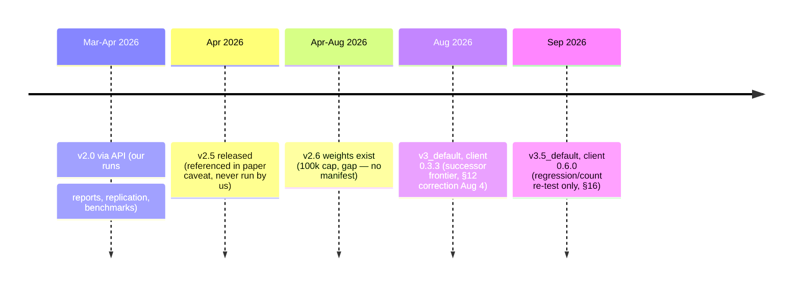

# Model Versions & Validity Timeline

> Read this before citing any number in this repo. Every finding is pinned to the TabPFN version that produced it — versions change behaviour, so findings do not automatically carry forward.
> Current pinned version is **v3_default (tabpfn-client 0.3.3)** for classification and the `eudirectlapse` lapse loss, and **v3.5_default (tabpfn-client 0.6.0)** for the four regression/count datasets re-tested on 2026-09-16 (master report §16, issue #186). The repo is therefore **split across two model lines** — check the per-artifact table below before citing any number. See `docs/reports/TABPFN_BENCHMARK_SUMMARY.md`, master report §12.1 (version correction) and §15 (re-test policy). Legacy v2-era rows below are frozen and must not be cited as current.

## The rule

> **Do not trust a metric on a new TabPFN version until it is re-run.** Note the `Tested:` line on every report/table, and check this timeline for what changed.

New runs must record: model version (`tabpfn` / `tabpfn-client` + weights ID e.g. `v2.6` / `v3_default`), date, seed, dataset SHA. Pattern to copy: this repo's `results/<run-dir>/manifest.json` + Version-Drift Re-Test Policy (trigger → scope → diff → addendum, master report §15, issue #55).

## Timeline — when we used what (with evidence)

| Used when | TabPFN model | API / package | Row cap (live-verified) | Evidence | Status |
|---|---|---|---|---|---|
| **Mar–Apr 2026: project work, all reports, replication, benchmarks** | **v2 era — v2.0 via API** | Hosted API; local package pin `tabpfn==2.6.0` is pip only; hosted runs used `tabpfn-client 0.2.8` | v2-era API (v2/v2.5 class: 50k rows — see successor §12 correction) | Paper: "reproducible using … TabPFN v2.0 API" + "We benchmarked TabPFN v2.0 via API (no GPU)" (`docs/papers/Theres-Life-in-the-Old-GLM-Yet.md:62,71`); registry dates 2026-03-29 → 2026-04-07 | **Frozen. Paper + April numbers are v2.0.** |
| **Apr 2026: paper writing — referenced only, never run** | **v2.5 (not our benchmark)** | n/a | 50k rows (same v2 class) | Same Caveat #2: "v2.5 achieves improved in-context learning… enhanced robustness" — describes the newer release, not our runs | **Do not cite our numbers as v2.5.** |
| **(unrecorded — gap)** | **v2.6 weights existed (100k cap) but no manifest proves we ran them** | `tabpfn_2_6` on HuggingFace (see `docs/provisioning_gpu.md`); no run manifest recorded weights ID | 100k rows (per successor §12 correction, verified 2026-08-04) | Absence of evidence: no manifest, no log cites v2.6 weights | **Treat April as v2.x. Never write "v2.6" without a manifest.** |
| **1–7 Aug 2026: successor frontier + benchmark suite** | **v3 (`v3_default`)** | `tabpfn-client 0.3.3`, `model_path="v3_default"` pinned post-hoc (runs used auto-selection resolving to v3) | 1M rows / 200M cells / 160 classes / 2,000 cols (live-verified 2026-08-04 via `/tabpfn/get_model_limits`) | Master report `docs/analyses/tabpfn_vs_gbdt_baselines_finetuning.md` (dated 2026-08-01, updated Aug 2/3/7; §12 correction 2026-08-04; §14.9 version note; §15 re-test policy); tags `paper-snapshot-2026-08-22`, `v8.2.0` | **Current for classification + the `eudirectlapse` loss.** The regression/count tier is superseded by the v3.5 row below. |
| **16 Sep 2026: version-drift re-test — regression/count tier only** | **v3.5 (`v3.5_default`)** | `tabpfn-client 0.6.0`, `model_path="v3.5_default"` resolved via `src/model_version.py` (`TABPFN_MODEL_PATH`, defaults to `v3_default`); the **server default is now v3.5**, so an unpinned call no longer resolves to v3 | 1M rows / 200M cells / 160 classes / **20,000 cols** — 10× the v3 column cap (live-verified 2026-09-16 via `/tabpfn/get_settings`) | Master report **§16** (issue [#186](https://github.com/IFoA-ADSWP/tabular-foundation-model/issues/186)); 4 datasets × 5 folds, seed 42; per-fold predictions + manifests persisted under `predictions/` | **Current for `freMTPL2freq`, `spanish_motor_freq`, `bemtl97_amount`, `spanish_motor_severity` only.** Classification tiers and `eudirectlapse` are still v3 — do not cite v3.5 for those. Caveat: `scikit-learn` drifted 1.6.1 → 1.9.0, so the `ols` rows are **not** comparable to v3 (§16.4). |

Tags: `paper-snapshot-2026-08-22` (pre-hygiene baseline backing §14.x verdicts), `v8.2.0` (benchmark suite + version-drift policy).

## What flipped between v2-era and v3 (so you are not confused)

| Finding (v2-era, legacy work, Mar–Apr 2026) | v3 re-test (this repo, Aug 2026) |
|---|---|
| "TabPFN is a small-data specialist" (wins ≤10k rows) | Refined: best risk-ranker on 6/6 classification sets **including 163–184k rows** (AUC deltas +0.006–+0.033 over best GLM); small-data is a secondary strength, not its identity |
| Lapse tie: GLM 0.599 vs TabPFN raw 0.593, calibrated Brier 0.1080 best | `eudirectlapse` disclosed as **genuine classification loss** (TabPFN 0.6101 vs best GLM 0.6260, additive structure); Spanish lapse is the real win (0.7553 vs 0.7500, 5/5 folds) |
| Regression: mixed, needs finetune | Confirmed at scale: off parsimony frontier 5/12, all at ≥53.5k rows — prefer GBDT/GLM for count model; claim/no-claim *reframe* is TabPFN triage territory (AUC #1, p≈0.001) |
| Calibration: +0.87% Brier via isotonic | Holds, with two ~1e-4 paired-significant exceptions vs tuned baselines (see §14.13) |

## What flipped between v3 and v3.5 (regression/count tier only, Sep 2026)

| Finding (v3, Aug 2026) | v3.5 re-test (§16, 2026-09-16) |
|---|---|
| Off the parsimony frontier **5 of 12**, all at ≥53.5k rows | **4 of 12** — `spanish_motor_freq` moved onto the frontier |
| Spanish frequency signal is "tree-extractable only": LGBM 0.8916 vs TabPFN 0.9876 (§14.9) | **Falsified for this dataset**: 0.9031 vs 0.8916, paired p=0.47 — not statistically separable |
| `freMTPL2freq` 0.3877 vs LGBM 0.2911 (+33%) | 0.3013 (−22.3%), gap +0.0101 — still paired-significant (p=0.0004, 0/5 folds), so **improved, not competitive** |
| `bemtl97_amount` / `spanish_motor_severity` losses | Both improved (−3.7% / −1.4%) but remain paired-significant losses; LGBM still ~1.4× better on `bemtl97_amount` |
| Not yet tested on v3.5 | Classification calibration tier, `bemtl16` lift, `eudirectlapse` — **still v3, open under #186** |

## Per-artifact validity (this repo)

| Artifact | Tested | TabPFN | Verdict |
|---|---|---|---|
| `docs/reports/*.md` (8 reports, registry `last_updated` 2026-04-04 → 2026-04-07) | Apr 2026 | v2 era (weights ID unrecorded) | v2-only; see banner on each report |
| `notebooks/adswp_project/REPLICATION_*` (seed 45, 70:30) | Apr 2026 | v2.0 via API (per paper) | Re-run on v3 before citing |
| `outputs/current/tables/*revalidation*.csv` (2026-04-05) | 2026-04-05 | v2 era | Superseded by this repo's frontier runs |
| `notebooks/baseline_experiments/01–08`, `scripts/*finetune*`, `scripts/run_*benchmark*` | Mar–Apr 2026 | v2 era | Methods reusable; numbers not portable |

## What to do

1. **Citing old numbers?** Quote with version: "TabPFN v2.0 via API (Mar–Apr 2026): lapse AUC 0.593 vs GLM 0.599". Never write "v2.6" unless you have a manifest proving the weights ID — `tabpfn==2.6.0` is the pip package, not the model.
2. **Running today?** Install, run, and write a `manifest.json` (model, package, date, seed, dataset SHA). If on v3, compare against `docs/reports/TABPFN_BENCHMARK_SUMMARY.md`, not the legacy v2-era tables.
3. **Bumping versions?** Follow the re-test policy: trigger (new weights/client) → scope (canonical folds) → diff (paired per-fold tests) → addendum (append here + report header, never silently overwrite).
