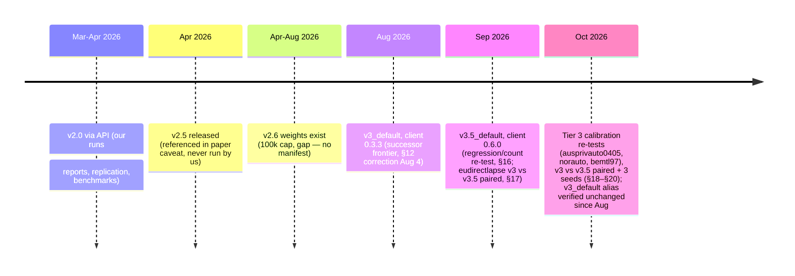

# Model Versions & Validity Timeline

> Read this before citing any number in this repo. Every finding is pinned to the TabPFN version that produced it — versions change behaviour, so findings do not automatically carry forward.
> Current pinned version is **v3_default (tabpfn-client 0.3.3)** for the canonical classification datasets, and **v3.5_default (tabpfn-client 0.6.0)** for the four regression/count datasets re-tested on 2026-09-16 (master report §16) and for `eudirectlapse`, re-tested on 2026-09-17 on both versions (§17; issue #186), and for the three Tier 3 calibration datasets — `ausprivauto0405`, `norauto`, `bemtl97` — re-tested on 2026-10-07 on both versions plus two more seeds (§18–§20). The published `eudirectlapse` loss (v3, AUC 0.6101) **did not reproduce** — see §17 before citing it. The `ausprivauto0405` calibration exception (§14.13.3) **does not hold on v3.5** — see §18. On `norauto`, v3.5 reverses the loss to LightGBM, but an exposure-aware GLM (not among the original baselines) edges both versions — see §19.4 before citing TabPFN as best on `norauto`. On `bemtl97`, v3.5 reverses the loss to LightGBM cleanly (§20). The repo is therefore **split across two model lines** — check the per-artifact table below before citing any number. See `docs/archive/TABPFN_BENCHMARK_SUMMARY.md`, master report §12.1 (version correction) and §15 (re-test policy). Legacy v2-era rows below are frozen and must not be cited as current.

## The rule

> **Do not trust a metric on a new TabPFN version until it is re-run.** Note the `Tested:` line on every report/table, and check this timeline for what changed.

New runs must record: model version (`tabpfn` / `tabpfn-client` + weights ID e.g. `v2.6` / `v3_default`), date, seed, dataset SHA. Pattern to copy: this repo's `results/<run-dir>/manifest.json` + Version-Drift Re-Test Policy (trigger → scope → diff → addendum, master report §15, issue #55).

## Timeline — when we used what (with evidence)

| Used when | TabPFN model | API / package | Row cap (live-verified) | Evidence | Status |
|---|---|---|---|---|---|
| **Mar–Apr 2026: project work, all reports, replication, benchmarks** | **v2 era — v2.0 via API** | Hosted API; local package pin `tabpfn==2.6.0` is pip only; hosted runs used `tabpfn-client 0.2.8` | v2-era API (v2/v2.5 class: 50k rows — see successor §12 correction) | Paper: "reproducible using … TabPFN v2.0 API" + "We benchmarked TabPFN v2.0 via API (no GPU)" (`docs/archive/archive/papers/Theres-Life-in-the-Old-GLM-Yet.md:62,71`); registry dates 2026-03-29 → 2026-04-07 | **Frozen. Paper + April numbers are v2.0.** |
| **Apr 2026: paper writing — referenced only, never run** | **v2.5 (not our benchmark)** | n/a | 50k rows (same v2 class) | Same Caveat #2: "v2.5 achieves improved in-context learning… enhanced robustness" — describes the newer release, not our runs | **Do not cite our numbers as v2.5.** |
| **(unrecorded — gap)** | **v2.6 weights existed (100k cap) but no manifest proves we ran them** | `tabpfn_2_6` on HuggingFace (see `docs/provisioning_gpu.md`); no run manifest recorded weights ID | 100k rows (per successor §12 correction, verified 2026-08-04) | Absence of evidence: no manifest, no log cites v2.6 weights | **Treat April as v2.x. Never write "v2.6" without a manifest.** |
| **1–7 Aug 2026: successor frontier + benchmark suite** | **v3 (`v3_default`)** | `tabpfn-client 0.3.3`, `model_path="v3_default"` pinned post-hoc (runs used auto-selection resolving to v3) | 1M rows / 200M cells / 160 classes / 2,000 cols (live-verified 2026-08-04 via `/tabpfn/get_model_limits`) | Master report `docs/analyses/tabpfn_vs_gbdt_baselines_finetuning.md` (dated 2026-08-01, updated Aug 2/3/7; §12 correction 2026-08-04; §14.9 version note; §15 re-test policy); tags `paper-snapshot-2026-08-22`, `v8.2.0` | **Current for the canonical classification datasets.** The regression/count tier and `eudirectlapse` are superseded by the v3.5 rows below; the `eudirectlapse` loss recorded here did not reproduce (§17). |
| **16 Sep 2026: version-drift re-test — regression/count tier only** | **v3.5 (`v3.5_default`)** | `tabpfn-client 0.6.0`, `model_path="v3.5_default"` resolved via `src/model_version.py` (`TABPFN_MODEL_PATH`, defaults to `v3_default`); the **server default is now v3.5**, so an unpinned call no longer resolves to v3 | 1M rows / 200M cells / 160 classes / **20,000 cols** — 10× the v3 column cap (live-verified 2026-09-16 via `/tabpfn/get_settings`) | Master report **§16** (issue [#186](https://github.com/IFoA-ADSWP/tabular-foundation-model/issues/186)); 4 datasets × 5 folds, seed 42; per-fold predictions + manifests persisted under `predictions/` | **Current for `freMTPL2freq`, `spanish_motor_freq`, `bemtl97_amount`, `spanish_motor_severity` only.** The canonical classification tiers are still v3 — do not cite v3.5 for those. Caveat: `scikit-learn` drifted 1.6.1 → 1.9.0, so the `ols` rows are **not** comparable to v3 (§16.4). |
| **17 Sep 2026: version-drift re-test — `eudirectlapse` classifier** | **v3 and v3.5, same day** (`v3_default` + `v3.5_default`) | `tabpfn-client 0.6.0`, both arms in one environment via `TABPFN_MODEL_PATH`; frontier harness (`--data`), not the TabArena lapse harness. Note `v3_default` is a server-side alias resolved to *its current default checkpoint*, so this v3 arm is not guaranteed to be the August checkpoint | unchanged | Master report **§17** (issue [#186](https://github.com/IFoA-ADSWP/tabular-foundation-model/issues/186)); 5 folds, seed 42, test folds identical to the published lapse benchmark (training data not — that harness held out a validation set); per-fold predictions for both arms under `predictions/` | **Current for `eudirectlapse`.** First genuine paired version test. The published v3 loss did not reproduce (§17.3–§17.4, cause unresolved). |
| **7 Oct 2026: version-drift re-test — Tier 3 calibration, `ausprivauto0405` + `norauto` + `bemtl97`** | **v3 and v3.5, same day** (seed 42), **v3.5** (seeds 7, 123) | `tabpfn-client 0.6.0`, `scikit-learn` 1.9.0, both arms via `TABPFN_MODEL_PATH` in an isolated venv; frontier harness, `--save-predictions` (fresh fits — no sweep reuse) | unchanged | Master report **§18** (`ausprivauto0405`), **§19** (`norauto`), **§20** (`bemtl97`) (issue [#186](https://github.com/IFoA-ADSWP/tabular-foundation-model/issues/186)); 5 folds × seeds 42/7/123 each; seeds 7/123 compare against committed August v3 folds (folds verified identical). Today's `v3_default` reproduces August's to ≤ 2.4e-5 log loss on all three datasets — **no alias drift** (§18.5, §19.5, §20.5) | **Current for the three Tier 3 datasets.** v3.5 improves log loss/Brier on every fold of all three; each published calibration loss reverses. `ausprivauto0405`: narrowly over the best GLM. `norauto`: beats LightGBM, but an exposure-aware GLM edges it (§19.4). `bemtl97`: clear win over LightGBM, AUC up too. |

```mermaid
timeline
    Mar-Apr 2026 : v2.0 via API (our runs: reports, replication, benchmarks)
    Apr 2026 : v2.5 released (referenced in paper caveat, never run by us)
    Apr-Aug 2026 : v2.6 weights exist (100k cap, gap — no manifest)
    Aug 2026 : v3_default, client 0.3.3 (successor frontier, §12 correction Aug 4)
    Sep 2026 : v3.5_default, client 0.6.0 (regression/count re-test, §16; eudirectlapse v3 vs v3.5 paired, §17)
    Oct 2026 : Tier 3 calibration re-tests (ausprivauto0405, norauto, bemtl97), v3 vs v3.5 paired + 3 seeds (§18–§20); v3_default alias verified unchanged since Aug
```

Tags: `paper-snapshot-2026-08-22` (pre-hygiene baseline backing §14.x verdicts), `v8.2.0` (benchmark suite + version-drift policy).

## What flipped between v2-era and v3 (so you are not confused)

| Finding (v2-era, legacy work, Mar–Apr 2026) | v3 re-test (this repo, Aug 2026) |
|---|---|
| "TabPFN is a small-data specialist" (wins ≤10k rows) | Refined: best risk-ranker on 6/6 classification sets **including 163–184k rows** (AUC deltas +0.006–+0.033 over best GLM); small-data is a secondary strength, not its identity |
| Lapse tie: GLM 0.599 vs TabPFN raw 0.593, calibrated Brier 0.1080 best | `eudirectlapse` disclosed as **genuine classification loss** (TabPFN 0.6101 vs best GLM 0.6260, additive structure); Spanish lapse is the real win (0.7553 vs 0.7500, 5/5 folds) |
| Regression: mixed, needs finetune | Confirmed at scale: off parsimony frontier 5/12, all at ≥53.5k rows — prefer GBDT/GLM for count model; claim/no-claim *reframe* is TabPFN triage territory (AUC #1, p≈0.001) |
| Calibration: +0.87% Brier via isotonic | Holds, with two ~1e-4 paired-significant exceptions vs tuned baselines (see §14.13) |

## What flipped between v3 and v3.5 (Sep–Oct 2026)

| Finding (v3, Aug 2026) | v3.5 re-test (§16 2026-09-16, §17 2026-09-17, §18–§20 2026-10-07) |
|---|---|
| Off the parsimony frontier **5 of 12**, all at ≥53.5k rows | **4 of 12** — `spanish_motor_freq` moved onto the frontier |
| Spanish frequency signal is "tree-extractable only": LGBM 0.8916 vs TabPFN 0.9876 (§14.9) | **Falsified for this dataset**: 0.9031 vs 0.8916, paired p=0.47 — not statistically separable |
| `freMTPL2freq` 0.3877 vs LGBM 0.2911 (+33%) | 0.3013 (−22.3%), gap +0.0101 — still paired-significant (p=0.0004, 0/5 folds), so **improved, not competitive** |
| `bemtl97_amount` / `spanish_motor_severity` losses | Both improved (−3.7% / −1.4%) but remain paired-significant losses; LGBM still ~1.4× better on `bemtl97_amount` |
| `eudirectlapse` is a **genuine classification loss**: TabPFN 0.6101 vs LR 0.6260, additive structure (§14.10, TabArena harness) | **Did not reproduce, even for v3** (§17). On identical folds in the frontier harness: v3 AUC 0.6331, v3.5 0.6367, one-hot LR 0.6271. Against that fair LR, v3 wins ranking and ties calibration; v3.5 wins all five metrics. Paired v3→v3.5: log loss, Brier and PR-AUC significantly better. Cause of the August gap unresolved: harness preprocessing vs `v3_default` alias drift (§17.4). **Do not cite as a model property.** |
| `ausprivauto0405`: the whole linear family beats TabPFN on log loss and Brier, seed-stable (§14.13.3) | **Does not hold on v3.5** (§18). Log loss 0.24026 → 0.23816 (p=0.0002, 5/5 folds), rank 5/9 → 1/9; holds on seeds 42/7/123. Beats one-hot LR, `glm_eng`, and one-hot LR + log(Exposure) — the last only narrowly (−0.0003 to −0.0004, p≈0.03–0.04). AUC unchanged within noise (still #1) |
| `v3_default` alias might resolve to a newer checkpoint than August's (§17.4) | **Not observed**: today's v3 matches August's per fold to ~1e-5 log loss on `ausprivauto0405`, `norauto` and `bemtl97` (§18.5, §19.5, §20.5) |
| `norauto`: TabPFN AUC #1 but loses log loss/Brier to LightGBM, 0.17619 vs 0.17518 (§14.11, §14.13.3) | **Loss reverses** (§19): v3.5 0.17446, beats LightGBM on 15/15 folds over seeds 42/7/123. **But** a one-hot GLM with log(`Expo`) — not among the original baselines — scores 0.17432, edging v3.5 on 13/15 folds and beating v3 on log loss/Brier (0/15) and, narrowly, AUC (§19.4). Baseline issue, not a version effect |
| `bemtl97`: TabPFN AUC #1 but rank 5/9 on log loss, behind LightGBM 0.34279 vs 0.34177 (§14.11, §14.13.3) | **Loss reverses** (§20): v3.5 0.34044, beats LightGBM on log loss/Brier/AUC on 15/15 folds over seeds 42/7/123; rank 1/9 on every seed. AUC also rises v3 → v3.5. The exposure-aware GLM (0.34209) trails LightGBM here, so no §19.4-style caveat |
| Not yet tested on v3.5 | `bemtl16` top-decile lift; the size sweep's 1k/5k cells — **still v3, open under #186** |

## Per-artifact validity (this repo)

| Artifact | Tested | TabPFN | Verdict |
|---|---|---|---|
| `docs/reports/*.md` (8 reports, registry `last_updated` 2026-04-04 → 2026-04-07) | Apr 2026 | v2 era (weights ID unrecorded) | v2-only; see banner on each report |
| `notebooks/adswp_project/REPLICATION_*` (seed 45, 70:30) | Apr 2026 | v2.0 via API (per paper) | Re-run on v3 before citing |
| `outputs/current/tables/*revalidation*.csv` (2026-04-05) | 2026-04-05 | v2 era | Superseded by this repo's frontier runs |
| `notebooks/baseline_experiments/01–08`, `scripts/*finetune*`, `scripts/run_*benchmark*` | Mar–Apr 2026 | v2 era | Methods reusable; numbers not portable |

## What to do

1. **Citing old numbers?** Quote with version: "TabPFN v2.0 via API (Mar–Apr 2026): lapse AUC 0.593 vs GLM 0.599". Never write "v2.6" unless you have a manifest proving the weights ID — `tabpfn==2.6.0` is the pip package, not the model.
2. **Running today?** Install, run, and write a `manifest.json` (model, package, date, seed, dataset SHA). If on v3, compare against `docs/archive/TABPFN_BENCHMARK_SUMMARY.md`, not the legacy v2-era tables.
3. **Bumping versions?** Follow the re-test policy: trigger (new weights/client) → scope (canonical folds) → diff (paired per-fold tests) → addendum (append here + report header, never silently overwrite).
