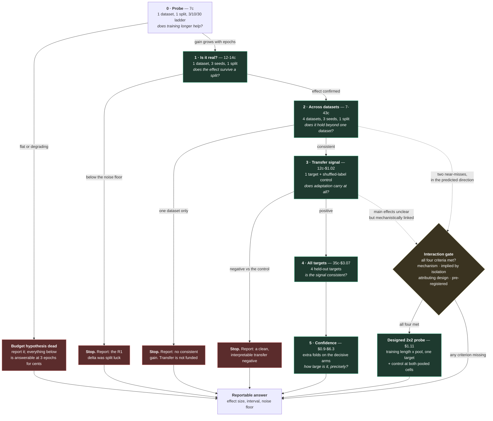

# Pilot 2 — the decision graph

**How to read this page.** Each node is one experiment, and each node is also a **stopping point**.
The edges are outcomes, not hopes: a designed experiment has to say in advance what it will do with
each one. Costs are cumulative along a path; the figure at each node is what *that step* adds.

Why a graph rather than a list: the design's whole claim is that **nothing is bought in advance**, and
that claim is a statement about the *edges* — what happens after each result — not about the steps.

## What is being tested, and on what evidence

**One question:** does fine-tuning TabPFN beat raw TabPFN and the actuarial baselines on insurance
data, first on the same dataset and then on a dataset it has never seen?

**The evidence this rests on is `docs/reference/FINE_TUNING_PILOT_RESULTS.md`** (the first pilot's results) with
`docs/archive/SMOKE_TEST_SCOPE.md` for what that pilot did and did not exercise. In one line: a 3-epoch in-domain
fine-tune did **not** reliably beat raw TabPFN (deltas of 0.0008-0.0095; one dataset negative), while
**using TabPFN at all** beat the best baseline by +0.068 on coil2000 at roughly a third of the
compute. That is why the budget is tested first and the transfer question is asked separately rather
than folded in.

**Read, in this order:** this page → `docs/reference/PILOT_2_DESIGN.md` (the specification this plan arrives at) →
`docs/current/FINETUNING_STATISTICAL_ANALYSIS_PLAN.md` (how the numbers are computed) →
`docs/current/FINETUNING_COST_AND_CONTROLS.md` (what it costs, and the controls). Background and evidence:
`docs/reference/FINE_TUNING_PILOT_RESULTS.md`, `docs/archive/SMOKE_TEST_SCOPE.md`, `docs/archive/HISTORIC_FINETUNING_APPRAISAL.md`. The
decisions are in `docs/current/FINETUNING_DECISION_LOG.md`; the isolation argument and the interaction policy are in
`docs/reference/PILOT_2_DESIGN_ALTERNATIVE.md`.

### Sequencing — what happens, in this order

1. **Merge the design (`#168`) and the code (`#173`).** The probe runs from a commit on `main`, not from
   an unmerged branch: a result produced by code nobody reviewed is not a result to lean on, and the
   run's manifest records the commit it came from.
2. **Run the probe** from that merged commit — one dataset, one split, four arms, about nine pence.
3. **Read it**, with the `ft3` replication gate and the recorded row-epochs in hand.
4. **Decide the wider testing on the result.** Nothing beyond the probe is released before it.

**The probe is a separate pilot, deliberately.** It answers one question and it is allowed to fail — a
flat ladder is a finding, not a wasted run. Holding the wider design (`docs/reference/PILOT_2_DESIGN.md`) back means
its release is a decision taken on evidence rather than on confidence, which is also what makes the
probe's cost defensible to a reader who is sceptical of the programme as a whole.

## Recommendation

**Adopt the staged-isolation design as the route. Keep the bundled design as the reference
specification. Let the 7p probe decide the rest.**

| Decision | Recommendation | Why |
| --- | --- | --- |
| **Route** | staged isolation (this page) | reaches the same decisions as the bundled design for ~$4.70, and a negative **names its cause** |
| **First spend** | the **7p probe** | tests the assumption carrying 65% of the programme's cost; if it fails, the programme stops for seven pence |
| **Datasets** | the four registered ones for the in-domain steps; the pool decided *after* the probe | if 3 epochs wins, an 11-dataset pool costs ~$7; if 30 epochs is needed, the pool must stay small (same-schema) |
| **Interactions** | gated off-ramp only | $1.11 for an attributable answer, against $31 for an ambiguous one |
| **Repeat structure** | 3 seeds x 1 split first; 5 folds only after an effect exists | a visible effect is a precondition for buying precision, not a reward for having none |
| **Budget** | ~$4.70 to the same decisions as the ~$31 design | fits the ~$9.60 credit with **no top-up** |
| **Bundled design** | retained as the reference specification | the isolation route arrives at it once each factor is known to matter — a better position to spend from, not a retreat |

**Not recommended, for the record:** running the bundled design first (~$31, needs a ~$21 top-up, and
a negative would be unattributable); running at full data scale (not estimated, with no evidence yet that the

> **No programme-scale figure is quoted.** An earlier draft gave one (~$368) by stacking three
> unmeasured assumptions at once -- the training-length curve, the pool sizes and the row scaling --
> before the probe that measures the largest of them. A number for that scope returns only when it
> can be derived from measurements, not from a curve we have not run.
effect grows with rows); pursuing an interaction before the isolation steps have produced a mechanism
and a near-miss to justify it.

**Spending note.** The recommendation is that the next action is the 7p probe — which is spend, and
therefore needs an explicit, current go-ahead. Nothing is provisioned on the strength of this page.

## The graph

## The same information as a table

| # | Test | Comparison | Positive → | Negative → | Cost | Cumulative |
| --- | --- | --- | --- | --- | --- | --- |
| 0 | Training ladder, 1 dataset, 1 split | 30 vs 10 vs 3 epochs | step 1 | **stop, report** | 7c | 7c |
| 1 | 1 dataset, 3 seeds, 1 split | fine-tuned vs raw | step 2 | **stop, report** | 12-14c | ~20c |
| 2 | 4 datasets, 3 seeds, 1 split | fine-tuned vs raw, per dataset | step 3 | **stop, report, no transfer** | 7-43c | ~60c |
| 3 | 1 target, coherent pool + control | pooled vs raw, vs shuffled labels | step 4 | **stop, report** | 12c-$1.02 | ~$1.70 |
| 4 | 3 remaining targets (step 3's is reused) | pooled vs raw, per target | step 5 | report at sample scale | 35c-$3.07 | ~$4.70 |
| 5 | Extra folds on the decisive arms | effect with an interval | report | report | $0.9-$6.3 | ~$5.6-$11 |
| I | Interaction, 2x2, 1 target | difference of differences | report as an estimate | report | $1.11 | — |

> **Two method notes, because an earlier revision got both wrong.** The transfer steps count **three**
> pooled arms per target — `C_pooled_all`, `D_pooled_schema`, and the label-shuffled control
> `R_random`, which is a full pooled training run — and **step 4 does not re-run step 3's target**;
> its result carries forward. Counting two pooled arms and re-running the probe target understated the
> steps 0-4 total by about 50c. The corrected figure, **~$4.70**, agrees with the independent
> calculation in `docs/current/FINETUNING_COST_AND_CONTROLS.md`.

## What each stopping point lets us claim

This is the table that matters for assessing the proposal: **every leaf is a deliverable**, including
the negative ones.

| If we stop at | We can state |
| --- | --- |
| 0 | "Training longer than 3 epochs does not improve fine-tuned TabPFN on this dataset." The budget hypothesis — the largest cost in the programme — is closed |
| 1 | "The R1 in-domain delta was within split variation." No fine-tuning case at any scale |
| 2 | "Fine-tuning gives no consistent gain across the four datasets." In-domain adaptation is not supported |
| 3 | "Adaptation does not transfer to an unseen dataset under a coherent pool." The question the historic work never answered cleanly |
| 4 | "Transfer is consistent across the four held-out targets, at sample scale." |
| 5 | "The effect is *X* with interval *Y*, against a noise floor of *Z*." The definitive figure |
| I | "Factors *P* and *Q* interact: *X* with interval *Y*." Attributable, because the design isolates the pair |

### Step 0 in full — the probe

One dataset, one split, four arms. Every parameter, and the reason it has that value.

| Parameter | Value | Why this value |
| --- | --- | --- |
| **Dataset** | **uslapseagent** | selected on **resolution, not cost**: 369 positives, resolves **≥ 0.009 ROC**. coil2000 — the repository's habitual first choice — resolves only **≥ 0.061**, because 6% of its rows are positive |
| Training rows | 2,000 | R1 parity: the same scale as every comparison we already hold, so the result is comparable rather than novel |
| Test rows | 1,000 | this is what sets the resolution above |
| Reserved rows | 500 | loaded but excluded, so the train-size cap can never reach the test rows; fingerprinted in the manifest |
| Epochs | 3 / 10 / 30 | 3 = R1 parity · 10 = midpoint · 30 = the library default, the "fair budget" nobody has tested |
| Arms | `A_raw` + the three rungs | `A_raw` is the baseline; without it the probe can only say whether the budget matters, not whether fine-tuning works |
| Seeds / splits | 1 × 1 | screening, not estimation — step 2 buys 3 seeds if this shows something |
| Context | matched across arms | asserted before any arm runs (PR-4): the confound the historic comparison died of |

### Why this split, and how it relates to the epochs

**2,000 train / 1,000 test, one split.** Three independent reasons, worth separating because they are
routinely conflated:

| Choice | Why |
| --- | --- |
| 2,000 training rows | **R1 parity** — the same scale as every comparison we already hold, so the probe's `ft3` rung is directly comparable to R1's result rather than merely similar |
| 1,000 test rows | **this is what sets the resolution.** The floor is driven by the TEST set's positives (369 here → ≥ 0.009 ROC), not by the training rows |
| 500 reserved | loaded and then excluded, so the train-size cap can never reach a test row. Their indices are fingerprinted in the manifest, so a reader can see they were dropped deliberately rather than lost |
| Stratified split | keeps the test set's positive rate at the dataset's rate. The resolution depends on the positive count, so leaving that to chance would make the detection floor a lottery |
| One split | screening, not estimation — three seeds is step 2, bought only on a positive |

**The cap is uniform, and that weakness is recorded rather than hidden.** `load_dataset` takes a uniform
sample of 3,500 rows *before* the stratified split, so the positive count is whatever that sample
happened to include — 57 for coil2000, 369 for uslapseagent. **A stratified cap would equalise positives
across datasets and is the cheapest available improvement to the minimum detectable effect**
(`docs/current/FINETUNING_STATISTICAL_ANALYSIS_PLAN.md` §12.1). It is a candidate change, not a made one, because it would
alter the split that every existing number was computed on.

**How the split relates to the epoch budget: they are not independent.**

An epoch is one pass over the training split, so the quantity that actually drives the model is
**rows × epochs**:

- 30 epochs over 2,000 rows = **60,000 row-passes**
- 30 epochs over 5,000 rows = **150,000 row-passes** — two and a half times the training, under the same label

Two consequences, both of which constrain how the result may be read:

1. **"30 epochs" is not a fixed amount of training.** It is 30 passes over *this* split. A flat ladder at
   2,000 rows closes the budget question **at 2,000 rows** — not "30 epochs does not help".
2. **Changing the split's scale changes the meaning of the budget.** Moving to 5,000 rows is not only more
   data; it is a different optimiser trajectory (more steps per epoch) at the same nominal epoch count.

So every arm records **row-epochs** (training rows × epochs) beside the declared epoch count. Without it,
a future run at another scale can return a different answer under the same label, and the two results
cannot be compared — the same class of ambiguity this design exists to remove.

**Three outcomes, not two:**

1. **The ladder rises** → the budget matters; carry the winning rung forward.
2. **The ladder is flat, but the fine-tuned arms beat `A_raw`** → fine-tuning works and the budget does
   not matter; carry **3 epochs** forward, which is the cheaper configuration.
3. **The ladder is flat and the fine-tuned arms do not beat `A_raw`** → the fine-tuning hypothesis is
   dead **at this scale**; report it with its minimum detectable effect beside it.

**Two preconditions before the result may be read:**

- **Early stopping must be disabled, or the executed epoch count recorded.** Otherwise "30 epochs"
  means "whatever early stopping allowed" and the probe measures a different quantity from the one it
  names.
- **The `ft3` arm replicates R1** — same dataset, same setting. R1 measured +0.0014 on coil2000 and
  −0.0008 to +0.0095 across the four. If `ft3` does not land in that band, the pipeline has changed and
  nothing else in the run is interpretable. A free validity gate.

## The assumptions we choose to make

Being surgical means deciding in advance what we are willing to *assume* rather than measure, and
choosing assumptions that are cheap to be wrong about.

1. **An effect invisible on one split will not be rescued by five folds.** If three seeds on a single
   split cannot see it, more folds buy precision on a null. Five folds are the *last* thing we buy,
   not the first.
2. **The test set's own noise is the floor, and we have already measured it.** R1's unpaired 95%
   interval width on ROC is 0.031-0.118 depending on the dataset, while R1's own in-domain deltas
   were 0.0008-0.0095 — an order of magnitude inside it. Comparing each delta against that width
   tells us whether more repeats are worth buying, so we need not buy them to find out.
3. **The heterogeneous pool is only worth running if the coherent one is interpretable.** This is
   already the design's pre-registered order; it saves a third of the transfer cost at every scale
   until the coherent pool has a result.
4. **Full data scale is only worth running if the sample shows the effect growing with rows.** The
   sample-to-full multiplier is ~14x; it is a reward for evidence, not an entry fee.
5. **The cheap baselines do not need re-running at every scale.** The GLM and CatBoost arms take
   seconds on CPU and are already recorded at every scale they matter.

## What we deliberately do not do

These are the experiments that would fill a schedule without changing the answer:

- five folds before an effect exists on one split;
- four targets before one target shows any signal;
- two pool policies before the coherent one has been read;
- the full epoch ladder at full data scale;
- fifteen repeats where the test set's own noise exceeds the effect being measured;
- any full-dataset run before the sample shows the effect growing.

## Monitoring: what we record at every step

Each step reports **the effect size, its interval, and the test set's noise floor**, and then asks a
single question: *is the effect bigger than the noise?* Only a yes buys the next step.

That is the whole control mechanism. Progress is visible after every step, the programme can stop at
any step with a reportable answer, and the largest cost in it sits behind the cheapest test in it.

## Three things a plain binary tree would get wrong

1. **Outcomes are not binary.** Each node's rule is a comparison against R1's *measured* noise floor
   (0.031-0.118 on ROC), not a yes/no. The graph branches on "clears the noise", "below it", and — not
   drawn, because it is the dangerous branch — "inconclusive". **The pre-registered rule for
   inconclusive is what stops this being a fishing trip**: it is stated before the run (extend the
   repeats to a pre-set maximum, or report the interval as inconclusive), never decided afterwards.
2. **Every node is also an exit.** The stop edges are first-class, and several are the *likely*
   outcome. A tree that only draws the happy path implies the programme is expected to reach the
   bottom, which is the opposite of the design's claim.
3. **Cost is cumulative along a path.** A per-step figure without the running total lets a reader add
   it up wrongly in either direction — as a fixed cost of the programme, or as never large.

## The interaction is an off-ramp, not a branch

Drawn dashed, entered from steps 2 and 3 only, and **gated by four criteria**: a stated technical
mechanism, an isolation result that implies it (two near-misses in the predicted direction), a design
that attributes it, and pre-registration. If any criterion is missing, the edge returns to *report*
rather than to *run*.

That is the whole visual argument for "isolation by default, interaction by decision": **the default
path never touches the interaction node, and the off-ramp has a guard on it.**

## Step 0 has run (13 Sep)

The probe cost **$0.0122** and found the ladder flat, with the arms at or below `A_raw`. **Step 0's stop rule
fired.** So, concretely:

- the later steps are **not funded**, not pending;
- the transfer stage loses its premise, because it was gated on in-domain showing a gain;
- the only thing worth spending on is narrower than any step above -- calibration at the full row count, one
  dataset, still cents.

The graph and its steps remain the reference specification for what a staged programme would have been. They
are not the programme being proposed.
