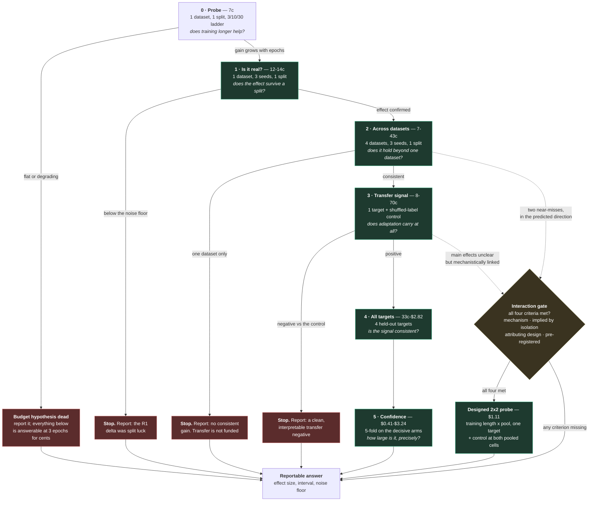

# Pilot 2 — the decision graph

**How to read this page.** Each node is one experiment, and each node is also a **stopping point**.
The edges are outcomes, not hopes: a designed experiment has to say in advance what it will do with
each one. Costs are cumulative along a path; the figure at each node is what *that step* adds.

Why a graph rather than a list: the design's whole claim is that **nothing is bought in advance**, and
that claim is a statement about the *edges* — what happens after each result — not about the steps.

## Recommendation

**Adopt the staged-isolation design as the route. Keep the bundled design as the reference
specification. Let the 7p probe decide the rest.**

| Decision | Recommendation | Why |
| --- | --- | --- |
| **Route** | staged isolation (this page) | reaches the same decisions as the bundled design for ~$4.15, and a negative **names its cause** |
| **First spend** | the **7p probe** | tests the assumption carrying 65% of the programme's cost; if it fails, the programme stops for seven pence |
| **Datasets** | the four registered ones for the in-domain steps; the pool decided *after* the probe | if 3 epochs wins, an 11-dataset pool costs ~$7; if 30 epochs is needed, the pool must stay small (same-schema) |
| **Interactions** | gated off-ramp only | $1.11 for an attributable answer, against $31 for an ambiguous one |
| **Repeat structure** | 3 seeds x 1 split first; 5 folds only after an effect exists | a visible effect is a precondition for buying precision, not a reward for having none |
| **Budget** | ~$4.15 to the same decisions as the ~$31 design | fits the ~$9.60 credit with **no top-up** |
| **Bundled design** | retained as the reference specification | the isolation route arrives at it once each factor is known to matter — a better position to spend from, not a retreat |

**Not recommended, for the record:** running the bundled design first (~$31, needs a ~$21 top-up, and
a negative would be unattributable); running at full data scale (~$367, with no evidence yet that the
effect grows with rows); pursuing an interaction before the isolation steps have produced a mechanism
and a near-miss to justify it.

**Spending note.** The recommendation is that the next action is the 7p probe — which is spend, and
therefore needs an explicit, current go-ahead. Nothing is provisioned on the strength of this page.

## The graph

## The same information as a table

| # | Test | Comparison | Positive → | Negative → | Cost | Cumulative |
| --- | --- | --- | --- | --- | --- | --- |
| 0 | Training ladder, 1 dataset, 1 split | 30 vs 10 vs 3 epochs | step 1 | **stop, report** | 7c | 7c |
| 1 | 1 dataset, 3 seeds, 1 split | fine-tuned vs raw | step 2 | **stop, report** | 12-14c | ~20c |
| 2 | 4 datasets, 3 seeds, 1 split | fine-tuned vs raw, per dataset | step 3 | **stop, report, no transfer** | 7-43c | ~60c |
| 3 | 1 target, coherent pool + control | pooled vs raw, vs shuffled labels | step 4 | **stop, report** | 8-70c | ~$1.30 |
| 4 | 4 targets | pooled vs raw, per target | step 5 | report at sample scale | 33c-$2.82 | ~$4.15 |
| 5 | 5-fold on decisive arms | effect with an interval | report | report | $0.41-$3.24 | ~$7.40 |
| I | Interaction, 2x2, 1 target | difference of differences | report as an estimate | report | $1.11 | — |

## What each stopping point lets us claim

This is the table that matters for assessing the proposal: **every leaf is a deliverable**, including
the negative ones.

| If we stop at | We can state |
| --- | --- |
| 0 | "Training longer than 3 epochs does not improve fine-tuned TabPFN on this dataset." The budget hypothesis — the largest cost in the programme — is closed |
| 1 | "The R1 in-domain delta was within split variation." No fine-tuning case at any scale |
| 2 | "Fine-tuning gives no consistent gain across the four datasets." In-domain adaptation is not supported |
| 3 | "Adaptation does not transfer to an unseen dataset under a coherent pool." The question the historic work never answered cleanly |
| 4 | "Transfer is consistent across the four held-out targets, at sample scale." |
| 5 | "The effect is *X* with interval *Y*, against a noise floor of *Z*." The definitive figure |
| I | "Factors *P* and *Q* interact: *X* with interval *Y*." Attributable, because the design isolates the pair |

## Three things a plain binary tree would get wrong

1. **Outcomes are not binary.** Each node's rule is a comparison against R1's *measured* noise floor
   (0.031-0.118 on ROC), not a yes/no. The graph branches on "clears the noise", "below it", and — not
   drawn, because it is the dangerous branch — "inconclusive". **The pre-registered rule for
   inconclusive is what stops this being a fishing trip**: it is stated before the run (extend the
   repeats to a pre-set maximum, or report the interval as inconclusive), never decided afterwards.
2. **Every node is also an exit.** The stop edges are first-class, and several are the *likely*
   outcome. A tree that only draws the happy path implies the programme is expected to reach the
   bottom, which is the opposite of the design's claim.
3. **Cost is cumulative along a path.** A per-step figure without the running total lets a reader add
   it up wrongly in either direction — as a fixed cost of the programme, or as never large.

## The interaction is an off-ramp, not a branch

Drawn dashed, entered from steps 2 and 3 only, and **gated by four criteria**: a stated technical
mechanism, an isolation result that implies it (two near-misses in the predicted direction), a design
that attributes it, and pre-registration. If any criterion is missing, the edge returns to *report*
rather than to *run*.

That is the whole visual argument for "isolation by default, interaction by decision": **the default
path never touches the interaction node, and the off-ramp has a guard on it.**
