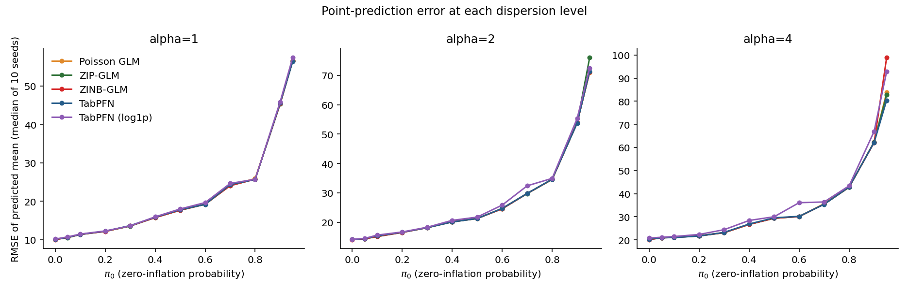
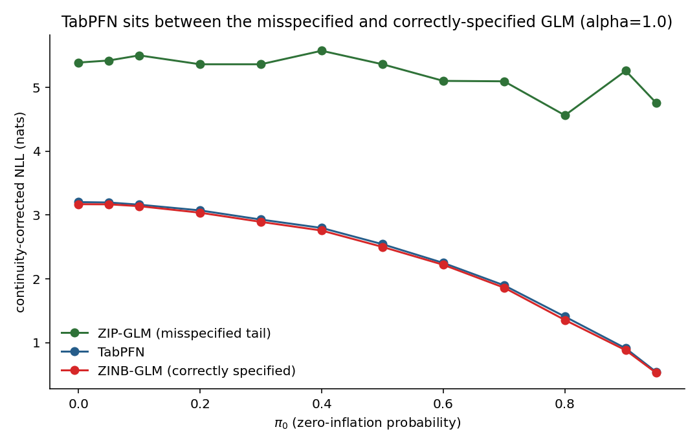
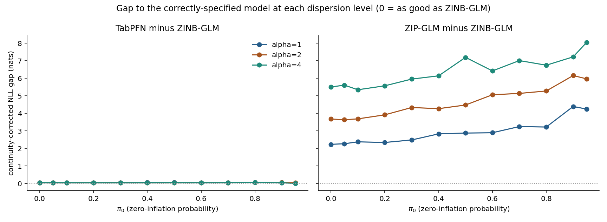
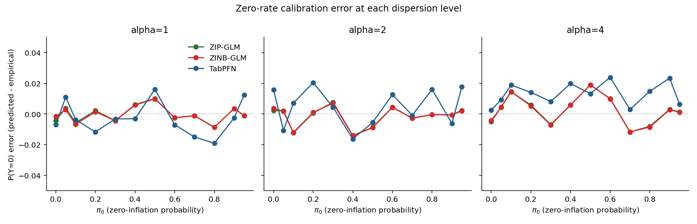

# Does TabPFN Handle Zero-Inflation?

TabPFN's zero-shot regressor, with no fine-tuning and no explicit handling for excess zeros or overdispersion, benchmarked against classical models built specifically for zero-inflated count data.

> **Status:** current as of 2026-09-17. Answers question 1 (zero inflation) of issue #159.
>
> **Tested:** TabPFN `v3.5_default` (hosted API, `tabpfn-client` 0.5.3)

## Short answer

**Yes.** Out of the box, TabPFN's mean prediction matches models purpose-built for zero-inflation, its predicted share of zeros stays within about ±0.025 of the truth, and its predictive uncertainty beats a classical model with the wrong tail assumption — despite never being told the data has excess zeros or overdispersion.

It does not reliably beat the exactly-correct model, but is never more than a few hundredths of a nat behind it at any setting tested.

## 1. The problem

Real count data — visits, defects, claims, purchases — is often **zero-inflated**: more zeros than Poisson predicts, and more spread than Poisson's variance-equals-mean rule allows. Classical fixes exist (zero-inflated Poisson, zero-inflated negative binomial), but require picking the right parametric family up front. TabPFN never assumes a parametric family. This study tests whether it needs one specified anyway.

Setup: five models score the same covariates and the same true conditional mean λ(x), under two arms. Baseline: plain Poisson. Test arm: zero-inflated negative binomial (ZINB) — excess zeros (π₀, swept 0→0.95) and overdispersion (α = 1, 2, 4) layered on top.

```
baseline   Y ~ Poisson(λ(x))
zip arm    Y ~ 0 w.p. π₀,  else NB2( μ=λ(x)/(1−π₀), Var=μ+αμ² )
```

Each of the three α values was run as an independent full sweep over all 12 π₀ values (0 → 0.95) plus the Poisson baseline, across 10 random seeds, refitting all five models on a freshly drawn 1,000-row train/test set for every (seed, π₀) cell — 650 scored rows per α, 1,950 in total. The sweep is resumable at the (arm, π₀, seed, model) level, so cells are directly comparable across the three α runs.

Both arms share the same mean, so point-prediction gaps are meaningful rather than noise. Whether a model noticed the zero-inflation shows up in the probabilistic metrics below.

- **`poisson_glm`** — naive baseline, structurally blind to excess zeros or overdispersion.
- **`zip_glm`** — the common real-world fix: zero-inflation-aware, but its count component is still Poisson. The mistake most practitioners make, since the true tail here is NB2.
- **`zinb_glm`** — gold standard: zero-inflation-aware and the exactly correct count distribution.
- **`tabpfn`** — TabPFN's hosted in-context regressor (`v3.5_default`), fit directly on raw counts. No parametric family, no fine-tuning, no hint that zero-inflation is present.
- **`tabpfn_log1p`** — same model with a log1p target transform, a common preprocessing trick for skewed counts.

## 2. How it was measured

- **RMSE / MAE of the predicted mean** — isolates whether a model's point prediction is thrown off by the noise shape, since every model sees the same true mean.
- **Continuity-corrected NLL** — negative log-likelihood with each model's predictive distribution integrated over [y−0.5, y+0.5] first. Makes TabPFN's continuous histogram directly comparable to a discrete GLM's probability mass function — the core metric for uncertainty quality.
- **P(Y=0) calibration** — predicted minus empirical zero rate. The most direct read on whether a model noticed the excess zeros.
- **Native-NLL failure rate** — how often a model's own predictive density is literally unevaluable (non-finite) at the true held-out value. A robustness check, not an accuracy one.

## 3. Results

### Point prediction: no penalty for not knowing the distribution

RMSE climbs with π₀ and with α for every model — the data's noise ceiling rising, not any model losing the mean. At every dispersion level, TabPFN's curve overlaps both purpose-built GLMs across the whole grid.



*zero_inflation_rmse_by_alpha.png — TabPFN (blue) tracks the true mean as well as models built specifically for this problem, with zero information about the parametric form. At the most extreme setting (α=4, π₀=0.95) it has the lowest error of all five models. The log1p variant (purple) drifts above the rest mid-grid at α=2 and α=4. Each point is the median over 10 seeds, because at α=4, π₀=0.95 a single ZINB-GLM fit extrapolates wildly (RMSE 1,309) and would swamp a mean.*

### Density quality: almost on top of the exactly-right model

Comparing TabPFN only to the naive zero-inflated-Poisson model would overstate its edge. The exactly-correct ZINB model is the honest comparison.



*zero_inflation_where_tabpfn_sits.png (α=1.0) — TabPFN (blue) sits between the almost-right model (green) and the exactly-right one (red) at every π₀, almost on top of the exactly-right one — with no training signal indicating excess zeros. The table and chart below show the same gaps at all three dispersion levels.*

| Gap to ZINB-GLM (continuity-corrected NLL, nats) | α | π₀=0.0 | π₀=0.5 | π₀=0.95 |
|---|---:|---:|---:|---:|
| ZIP-GLM (naive fix) | 1 | +2.22 | +2.86 | +4.23 |
| | 2 | +3.66 | +4.46 | +5.96 |
| | 4 | +5.49 | +7.18 | +8.04 |
| TabPFN (no fix at all) | 1 | +0.03 | +0.04 | +0.01 |
| | 2 | +0.03 | +0.03 | +0.02 |
| | 4 | +0.03 | +0.03 | −0.01 |

Positive = worse than the correctly-specified model. The naive fix falls further behind as both zero-inflation and dispersion grow, reaching +8 nats. TabPFN's gap stays flat at a few hundredths of a nat everywhere — at least 60 times smaller than the naive fix's at every π₀ and α — and at α=4, π₀=0.95 TabPFN is slightly ahead of the correct model.



*zero_inflation_nll_gap_by_alpha.png — both panels share one scale. The naive fix (right) falls further behind at each step up in dispersion; TabPFN (left) stays on the zero line at every π₀ and α.*

### Zero-calibration: close to the purpose-built models



*zero_inflation_p_zero_error_by_alpha.png — predicted minus actual share of zeros (0 = perfect). The two purpose-built models almost coincide (green is hidden under red). The Poisson GLM is off the chart: it under-predicts the zero rate by 0.11 to 0.93.*

TabPFN has no zero-inflation component at all, yet stays within ±0.02 of the actual zero rate at α=1 and α=2, and between 0 and +0.025 at α=4, where it slightly over-predicts zeros. That is only a little looser than the purpose-built GLMs, which stay within ±0.01 at α=1 and ±0.02 at α=2 and 4.

### Robustness: no density failures

TabPFN's own predictive density was finite on every one of the 360,000 test rows in the zero-inflated arm, across all three dispersion levels. Neither GLM fails this way at any setting either.


## 4. Conclusion

### Yes — TabPFN handles it, with two things to watch

- **Point prediction: solved.** TabPFN's mean matches models designed for this problem, at every zero-inflation and dispersion level tested.
- **Uncertainty quality: very good, not best.** Beats the common misspecified fix by a wide margin, and trails the exactly-correct model by only a few hundredths of a nat — sometimes matching it. Most of the benefit of knowing the parametric form, without specifying it.
- **Zero-calibration: good.** Within about ±0.025 of the empirical zero rate at every zero-inflation and dispersion level, close to models with an explicit zero-inflation component.
- **Robustness: no failures.** Its predictive density was finite on every test row, at every setting.
- **Watch 1 — preprocessing: a log-transform bought no accuracy gain** (a slightly worse density fit, up to +0.06 nats, and a worse worst-case RMSE) and introduced a real numerical hazard in mean estimation. Verify how any point estimate off a transformed target is computed.
- **Watch 2 — model version.** These results are for `v3.5_default`; v3 did noticeably worse on the same data. Pin the model version and re-test before relying on these results with another one.

TabPFN handles zero-inflated, overdispersed count data competently with no additional fine-tuning — matching on point prediction, and nearly matching on zero-calibration and uncertainty quality, statistical models built with full knowledge of the true generative process.

---

## Source Workbooks

- `scripts/eval/zero_inflation/run_sweep.py` — the sweep: data generation, model fits and scoring per (arm, π₀, seed, model); run once per `--alpha`
- `scripts/eval/zero_inflation/dgp.py`, `models.py`, `metrics.py` — data-generating process, model wrappers (TabPFN pinned to `v3.5_default` in `models.py`), metrics
- `scripts/eval/zero_inflation/analyze.py` — per-α diagnostic plots
- `scripts/eval/zero_inflation/make_report_charts.py` — the four charts in this report
- `notebooks/baseline_experiments/09_zero_inflation_dispersion.ipynb` — cross-α analysis behind the numbers quoted here

## Evidence Files

- `scripts/eval/zero_inflation/results/alpha_{1.0,2.0,4.0}/results.csv` — 650 scored rows per α (5 models × 13 cells × 10 seeds), plus per-α diagnostic plots
- `scripts/eval/zero_inflation/results/alpha_1.0_v3/results.csv` — the superseded first α=1.0 run, whose TabPFN rows came from v3; kept as the evidence behind Watch 2
- `outputs/current/figures/zero_inflation_*.png` — the four charts above
